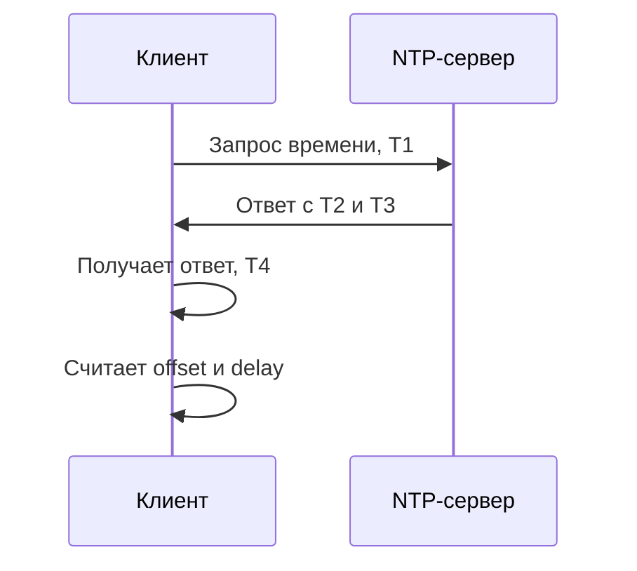
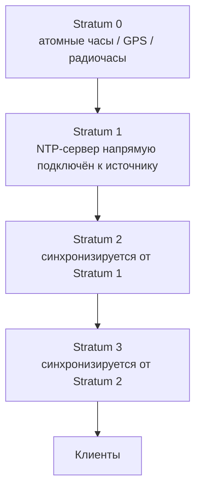
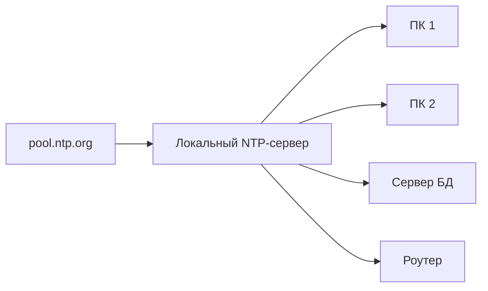

**NTP** — Network Time Protocol.  
Это сетевой протокол, который синхронизирует системные часы компьютеров, серверов, роутеров и других устройств.

Обычно NTP работает поверх **UDP-порта 123**.

Главная задача NTP — сделать так, чтобы время на устройстве было максимально близко к эталонному времени.

Примеры, где это важно:

- логи серверов;
- HTTPS-сертификаты;
- Kerberos / Active Directory;
- базы данных;
- cron/systemd timers;
- CI/CD;
- мониторинг;
- 2FA/TOTP-коды;
- распределённые системы;
- трейдинг, телеком, промышленность.

> [!important]
> NTP синхронизирует **время**, но не передаёт часовой пояс.  
> Часовой пояс настраивается отдельно в ОС.

---

# 1. Что такое NTP-сервер

**NTP-сервер** — это сервер, который отдаёт точное время NTP-клиентам.

Пример:

```text
Твой ноутбук  --->  NTP-сервер  --->  источник точного времени
```

Устройство-клиент спрашивает у NTP-сервера текущее время.  
Сервер отвечает, а клиент корректирует свои системные часы.

---

# 2. Базовая схема работы



В NTP используются четыре временные метки:

| Метка | Что означает |
|---|---|
| `T1` | время отправки запроса клиентом |
| `T2` | время получения запроса сервером |
| `T3` | время отправки ответа сервером |
| `T4` | время получения ответа клиентом |

На основе этих меток клиент оценивает:

- задержку сети;
- разницу между своими часами и часами сервера;
- насколько сильно нужно подвинуть локальное время.

---

# 3. Offset и delay

## Offset

**Offset** — это примерная разница между временем клиента и временем сервера.

Проще:

```text
offset = насколько мои часы спешат или отстают
```

Если offset большой, значит локальное время заметно отличается от эталонного.

## Delay

**Delay** — это задержка прохождения NTP-пакета туда и обратно.

Проще:

```text
delay = сколько времени заняла дорога клиент → сервер → клиент
```

Чем меньше delay, тем лучше.

## Jitter

**Jitter** — это нестабильность задержки.

Проще:

```text
jitter = насколько сильно скачет качество измерений
```

Если jitter высокий, значит ответы приходят нестабильно: то быстро, то медленно.  
Такой источник времени менее надёжен.

---

# 4. Stratum

**Stratum** — уровень удалённости NTP-сервера от эталонного источника времени.



## Основные уровни

| Stratum | Значение |
|---|---|
| `0` | эталонный источник, например GPS или атомные часы |
| `1` | сервер напрямую подключён к stratum 0 |
| `2` | сервер синхронизируется от stratum 1 |
| `3–15` | следующие уровни |
| `16` | сервер считается несинхронизированным |

> [!note]
> Stratum 0 обычно не является обычным сетевым NTP-сервером.  
> Это физический источник времени: GPS-приёмник, атомные часы и т.д.

---

# 5. NTP, SNTP, PTP

## NTP

**NTP** — полноценный протокол синхронизации времени.  
Он умеет:

- выбирать лучший источник времени;
- учитывать сетевую задержку;
- фильтровать плохие источники;
- постепенно корректировать часы;
- работать с несколькими серверами.

## SNTP

**SNTP** — Simple Network Time Protocol.  
Это упрощённый вариант NTP.

Он использует похожий формат пакета, но проще по алгоритмам.

SNTP подходит для простых устройств:

- IoT;
- бытовые роутеры;
- простые embedded-системы;
- устройства, где не нужна высокая точность.

## PTP

**PTP** — Precision Time Protocol.  
Это отдельный протокол для более точной синхронизации времени, часто используется в промышленных сетях, телекоммуникациях и финансовой инфраструктуре.

Очень грубо:

| Протокол | Где обычно используется |
|---|---|
| NTP | обычные серверы, ПК, Linux, интернет |
| SNTP | простые устройства |
| PTP | сети с высокой точностью, промышленность, телеком |

---

# 6. System clock, hardware clock и timezone

В Linux есть несколько связанных понятий.

## System clock

**System clock** — системные часы, которые ведёт ядро Linux во время работы системы.

Именно это время используют:

- программы;
- логи;
- systemd;
- cron;
- браузер;
- базы данных.

## Hardware clock / RTC

**Hardware clock** или **RTC** — аппаратные часы на материнской плате.

Они продолжают идти, когда компьютер выключен.

При загрузке Linux обычно читает RTC и выставляет system clock.

## Timezone

**Timezone** — часовой пояс.

Например:

```text
Asia/Tbilisi
Europe/Moscow
UTC
```

NTP не говорит системе: “ты в Москве” или “ты в Тбилиси”.  
NTP даёт точное UTC-время, а локальное отображение зависит от timezone.

---

# 7. Step и slew

Когда время на устройстве отличается от точного, систему надо скорректировать.

Есть два подхода.

## Step

**Step** — резкий скачок времени.

Например:

```text
12:00:00 → 12:05:00
```

Плюс: быстро исправляет большую ошибку.  
Минус: может ломать приложения, логи, таймеры и базы данных.

## Slew

**Slew** — плавная корректировка.

Время не прыгает резко, а немного ускоряется или замедляется, пока не догонит точное.

Плюс: безопаснее для работающей системы.  
Минус: исправление большой ошибки занимает время.

Обычно при старте системы допустим `step`, а во время нормальной работы лучше `slew`.

---

# 8. Популярные реализации в Linux

## systemd-timesyncd

Лёгкий клиент синхронизации времени от systemd.

Подходит для:

- обычного ПК;
- ноутбука;
- простой виртуальной машины;
- домашней системы.

Плюсы:

- уже есть в systemd-системах;
- простая настройка;
- хорошо подходит для обычного пользователя.

Минусы:

- не полноценный мощный NTP-демон;
- не лучший вариант для сложного сервера времени.

## chrony

Современный и очень практичный NTP-клиент/сервер.

Подходит для:

- серверов;
- ноутбуков;
- нестабильных сетей;
- виртуальных машин;
- систем, которые часто засыпают и просыпаются;
- локального NTP-сервера.

Плюсы:

- быстро синхронизируется;
- хорошо работает при нестабильном интернете;
- умеет быть и клиентом, и сервером;
- удобные диагностические команды.

## ntpd / ntpsec

Классические реализации NTP.

Используются в серверной инфраструктуре, но во многих современных Linux-сценариях часто выбирают `chrony`.

---

# 9. Настройка NTP на Arch Linux через systemd-timesyncd

## Проверить текущее состояние

```bash
timedatectl status
```

Обращай внимание на строки:

```text
System clock synchronized: yes
NTP service: active
RTC in local TZ: no
```

## Включить синхронизацию времени

```bash
sudo timedatectl set-ntp true
```

Проверить:

```bash
timedatectl status
```

## Посмотреть статус синхронизации

```bash
timedatectl timesync-status
```

Также можно посмотреть логи:

```bash
journalctl -u systemd-timesyncd
```

## Настроить свои NTP-серверы

Лучше не править основной файл напрямую, а создать drop-in конфиг:

```bash
sudo mkdir -p /etc/systemd/timesyncd.conf.d
sudo nano /etc/systemd/timesyncd.conf.d/ntp.conf
```

Пример:

```ini
[Time]
NTP=0.ge.pool.ntp.org 1.ge.pool.ntp.org time.cloudflare.com
FallbackNTP=0.arch.pool.ntp.org 1.arch.pool.ntp.org
```

Перезапустить:

```bash
sudo systemctl restart systemd-timesyncd
```

Проверить:

```bash
timedatectl timesync-status
```

---

# 10. Локальный NTP-сервер в сети

Можно сделать один сервер в локальной сети, который будет синхронизироваться с внешними источниками, а остальные устройства будут брать время у него.



## Пример chrony-сервера для LAN

Файл:

```bash
/etc/chrony.conf
```

Пример:

```conf
pool ge.pool.ntp.org iburst

allow 192.168.1.0/24

makestep 1.0 3
rtcsync
```

Что значит:

| Строка | Значение |
|---|---|
| `pool ge.pool.ntp.org iburst` | брать время из внешнего пула |
| `allow 192.168.1.0/24` | разрешить клиентам из локальной сети обращаться к серверу |
| `makestep 1.0 3` | разрешить резкую начальную коррекцию |
| `rtcsync` | синхронизировать RTC |

Клиенты в LAN могут использовать сервер:

```conf
server 192.168.1.10 iburst
```

---

# 15. NTS — защищённый NTP

**NTS** — Network Time Security.  
Это расширение для защиты NTP.

Обычный NTP сам по себе не гарантирует криптографическую подлинность сервера.  
NTS добавляет механизм защиты от подмены источника времени.

NTS полезен, если важно быть уверенным, что время пришло от настоящего сервера, а не от атакующего.

Пример для chrony, если выбранный сервер поддерживает NTS:

```conf
server time.example.org iburst nts
```

> [!note]
> Не каждый NTP-сервер поддерживает NTS.  
> Это нужно проверять отдельно по документации конкретного сервера.

---

# 16. Безопасность NTP

## Не открывать NTP-сервер в интернет без необходимости

Открытый NTP-сервер может стать частью DDoS-атак, если он неправильно настроен.

Для обычного домашнего ПК входящий UDP/123 открывать не нужно.  
Достаточно исходящих запросов к NTP-серверам.

## Ограничивать клиентов

Если ты поднимаешь локальный NTP-сервер, разрешай только свою сеть:

```conf
allow 192.168.1.0/24
```

## Использовать несколько источников

Лучше использовать несколько независимых источников времени.  
Это помогает обнаружить плохой или ошибочный сервер.

## Не смешивать разные NTP-демоны

Не надо одновременно запускать:

- `systemd-timesyncd`;
- `chronyd`;
- `ntpd`.

Выбери один.
