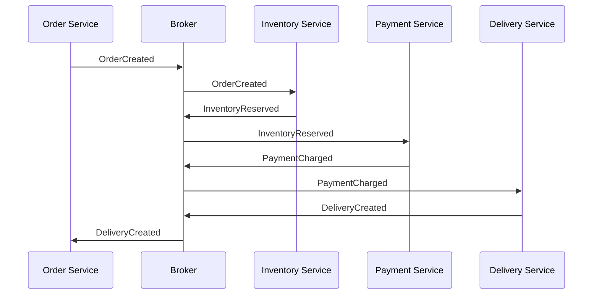
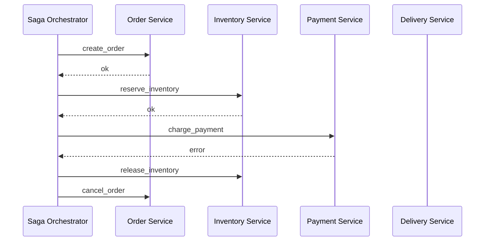

## 1. Определение и назначение паттерна Saga

**Saga** — это паттерн проектирования для обеспечения согласованности данных в распределённых системах, особенно в микросервисной архитектуре.

В микросервисах каждый сервис обычно владеет своей базой данных:

```text
Order Service      → orders_db
Payment Service    → payments_db
Inventory Service  → inventory_db
Delivery Service   → delivery_db
```

Из-за этого нельзя просто открыть одну ACID-транзакцию на все сервисы.

**Saga** решает это так:

> Одна большая бизнес-транзакция разбивается на цепочку локальных транзакций.  
> Если один из шагов падает, запускаются компенсирующие транзакции для уже успешно выполненных шагов.

---

## 2. Главная идея Saga

Пример оформления заказа:

```text
1. Создать заказ
2. Зарезервировать товар
3. Списать оплату
4. Создать доставку
5. Подтвердить заказ
```

Если шаг `3. Списать оплату` упал, нужно компенсировать предыдущие шаги:

```text
2. Снять резерв товара
1. Отменить заказ
```

Важно:

> Saga не делает `ROLLBACK` как база данных.  
> Она выполняет новые бизнес-операции, которые логически отменяют уже выполненные действия.

---

## 3. Компенсирующие транзакции

| Основная операция | Компенсация |
|---|---|
| создать заказ | отменить заказ |
| зарезервировать товар | снять резерв |
| списать деньги | вернуть деньги |
| создать доставку | отменить доставку |
| начислить бонусы | списать бонусы |
| отправить email | часто невозможно полноценно отменить |

Компенсация не всегда является техническим откатом.  
Например, если платёж прошёл, то компенсация — это не удаление записи из БД, а операция возврата денег.

---

## 4. Eventual Consistency

Saga обычно даёт **eventual consistency** — согласованность в конечном итоге.

Это значит:

```text
Во время выполнения Saga система может быть временно рассогласована,
но после завершения всех шагов или компенсаций она должна прийти в корректное состояние.
```

Пример временного состояния:

```text
Заказ создан
Товар зарезервирован
Оплата ещё не прошла
```

Это нормально, если система умеет правильно обрабатывать такие промежуточные статусы.

---

## 5. Saga vs 2PC

### 2PC — Two-Phase Commit

**2PC** — двухфазный коммит.

```text
1. Prepare phase
   Все участники готовятся и блокируют ресурсы.

2. Commit phase
   Координатор говорит всем зафиксировать изменения.
```

Проблема 2PC:

- долгие блокировки;
- зависимость от координатора;
- плохо масштабируется в микросервисах;
- сложнее переживает сетевые сбои.

### Saga

Saga работает оптимистично:

```text
1. Каждый шаг сразу фиксирует локальную транзакцию.
2. При ошибке запускаются компенсации.
```

| Критерий | 2PC | Saga |
|---|---|---|
| Подход | пессимистичный | оптимистичный |
| Блокировки | долгие | минимальные |
| Согласованность | сильнее | eventual consistency |
| Масштабируемость | хуже | лучше |
| Подходит для микросервисов | часто плохо | часто хорошо |
| Сложность бизнес-логики | ниже | выше |

---

# 6. Виды реализации Saga

Есть два основных подхода:

1. **Choreography** — хореография.
2. **Orchestration** — оркестрация.

---

# 7. Choreography Saga

## Идея

В хореографии нет центрального управляющего сервиса.

Сервисы публикуют события и реагируют на события других сервисов.

```text
Order Service публикует OrderCreated
Inventory Service слушает OrderCreated и публикует InventoryReserved
Payment Service слушает InventoryReserved и публикует PaymentCharged
Delivery Service слушает PaymentCharged и публикует DeliveryCreated
```

## Схема



## Пример события

```json
{
  "event_id": "evt_001",
  "event_type": "OrderCreated",
  "saga_id": "saga_123",
  "order_id": "ord_777",
  "user_id": "usr_1",
  "amount": 1200,
  "items": [
    {
      "sku": "iphone_15",
      "qty": 1
    }
  ]
}
```

`saga_id` нужен, чтобы связать все события одной бизнес-транзакции.

---

## Пример кода: Choreography на Python

Это учебный пример без настоящего Kafka/RabbitMQ.

```python
from dataclasses import dataclass
from typing import Callable


@dataclass(frozen=True)
class Event:
    event_type: str
    saga_id: str
    payload: dict


class EventBus:
    def __init__(self) -> None:
        self.handlers: dict[str, list[Callable[[Event], None]]] = {}

    def subscribe(self, event_type: str, handler: Callable[[Event], None]) -> None:
        self.handlers.setdefault(event_type, []).append(handler)

    def publish(self, event: Event) -> None:
        print(f"PUBLISH: {event.event_type} | saga={event.saga_id}")

        for handler in self.handlers.get(event.event_type, []):
            handler(event)
```

### Order Service

```python
class OrderService:
    def __init__(self, bus: EventBus) -> None:
        self.bus = bus
        self.orders: dict[str, str] = {}

        self.bus.subscribe("DeliveryCreated", self.confirm_order)
        self.bus.subscribe("PaymentFailed", self.cancel_order)
        self.bus.subscribe("InventoryReservationFailed", self.cancel_order)

    def create_order(self, saga_id: str, order_id: str, user_id: str, amount: int) -> None:
        self.orders[order_id] = "CREATED"

        self.bus.publish(
            Event(
                event_type="OrderCreated",
                saga_id=saga_id,
                payload={
                    "order_id": order_id,
                    "user_id": user_id,
                    "amount": amount,
                    "sku": "iphone_15",
                    "qty": 1,
                },
            )
        )

    def confirm_order(self, event: Event) -> None:
        order_id = event.payload["order_id"]
        self.orders[order_id] = "CONFIRMED"
        print(f"Order {order_id} confirmed")

    def cancel_order(self, event: Event) -> None:
        order_id = event.payload["order_id"]
        self.orders[order_id] = "CANCELLED"
        print(f"Order {order_id} cancelled")
```

### Inventory Service

```python
class InventoryService:
    def __init__(self, bus: EventBus) -> None:
        self.bus = bus
        self.stock = {"iphone_15": 10}
        self.reserved: dict[str, str] = {}

        self.bus.subscribe("OrderCreated", self.reserve_inventory)
        self.bus.subscribe("PaymentFailed", self.release_inventory)

    def reserve_inventory(self, event: Event) -> None:
        order_id = event.payload["order_id"]
        sku = event.payload["sku"]
        qty = event.payload["qty"]

        if self.stock.get(sku, 0) < qty:
            self.bus.publish(
                Event(
                    event_type="InventoryReservationFailed",
                    saga_id=event.saga_id,
                    payload=event.payload,
                )
            )
            return

        self.stock[sku] -= qty
        self.reserved[order_id] = sku

        self.bus.publish(
            Event(
                event_type="InventoryReserved",
                saga_id=event.saga_id,
                payload=event.payload,
            )
        )

    def release_inventory(self, event: Event) -> None:
        order_id = event.payload["order_id"]
        sku = self.reserved.pop(order_id, None)

        if sku is not None:
            self.stock[sku] += 1
            print(f"Inventory released for order {order_id}")
```

### Payment Service

```python
class PaymentService:
    def __init__(self, bus: EventBus) -> None:
        self.bus = bus
        self.payments: dict[str, str] = {}

        self.bus.subscribe("InventoryReserved", self.charge_payment)

    def charge_payment(self, event: Event) -> None:
        order_id = event.payload["order_id"]
        amount = event.payload["amount"]

        if amount > 1000:
            self.payments[order_id] = "FAILED"

            self.bus.publish(
                Event(
                    event_type="PaymentFailed",
                    saga_id=event.saga_id,
                    payload=event.payload,
                )
            )
            return

        self.payments[order_id] = "CHARGED"

        self.bus.publish(
            Event(
                event_type="PaymentCharged",
                saga_id=event.saga_id,
                payload=event.payload,
            )
        )
```

### Delivery Service

```python
class DeliveryService:
    def __init__(self, bus: EventBus) -> None:
        self.bus = bus
        self.deliveries: dict[str, str] = {}

        self.bus.subscribe("PaymentCharged", self.create_delivery)

    def create_delivery(self, event: Event) -> None:
        order_id = event.payload["order_id"]
        self.deliveries[order_id] = "CREATED"

        self.bus.publish(
            Event(
                event_type="DeliveryCreated",
                saga_id=event.saga_id,
                payload=event.payload,
            )
        )
```

### Запуск

```python
bus = EventBus()

order_service = OrderService(bus)
inventory_service = InventoryService(bus)
payment_service = PaymentService(bus)
delivery_service = DeliveryService(bus)

order_service.create_order(
    saga_id="saga_123",
    order_id="ord_777",
    user_id="usr_1",
    amount=1200,
)

print(order_service.orders)
print(inventory_service.stock)
print(payment_service.payments)
print(delivery_service.deliveries)
```

Так как `amount = 1200`, оплата упадёт, будет опубликовано событие `PaymentFailed`, склад снимет резерв, а заказ перейдёт в `CANCELLED`.

---

## Плюсы Choreography

- нет центрального оркестратора;
- хорошо ложится на event-driven архитектуру;
- меньше прямых зависимостей между сервисами;
- нет единой точки управления;
- проще стартовать на маленьких сценариях.

## Минусы Choreography

- сложно понять весь процесс целиком;
- сложно дебажить;
- легко получить циклические зависимости;
- сложно тестировать полный бизнес-сценарий;
- при росте системы возникает `event spaghetti`;
- трудно понять, кто отвечает за финальный статус Saga.

---

# 8. Orchestration Saga

## Идея

В оркестрации есть отдельный управляющий компонент — **Saga Orchestrator**.

Он управляет порядком шагов:

```text
1. create_order
2. reserve_inventory
3. charge_payment
4. create_delivery
5. confirm_order
```

И знает, какие компенсации запускать при ошибке:

```text
release_inventory
refund_payment
cancel_delivery
cancel_order
```

## Схема



---

## Пример кода: Orchestration на Python

```python
from dataclasses import dataclass
from typing import Callable


class SagaError(Exception):
    pass


@dataclass
class SagaStep:
    name: str
    action: Callable[[], None]
    compensation: Callable[[], None] | None = None
```

### Сервисы

```python
class OrderService:
    def __init__(self) -> None:
        self.orders: dict[str, str] = {}

    def create_order(self, order_id: str) -> None:
        print("Create order")
        self.orders[order_id] = "CREATED"

    def confirm_order(self, order_id: str) -> None:
        print("Confirm order")
        self.orders[order_id] = "CONFIRMED"

    def cancel_order(self, order_id: str) -> None:
        print("Cancel order")
        self.orders[order_id] = "CANCELLED"


class InventoryService:
    def __init__(self) -> None:
        self.stock = {"iphone_15": 10}
        self.reserved_orders: set[str] = set()

    def reserve(self, order_id: str, sku: str, qty: int) -> None:
        print("Reserve inventory")

        if self.stock.get(sku, 0) < qty:
            raise SagaError("Not enough stock")

        self.stock[sku] -= qty
        self.reserved_orders.add(order_id)

    def release(self, order_id: str, sku: str, qty: int) -> None:
        print("Release inventory")

        if order_id in self.reserved_orders:
            self.reserved_orders.remove(order_id)
            self.stock[sku] += qty


class PaymentService:
    def __init__(self) -> None:
        self.payments: dict[str, str] = {}

    def charge(self, order_id: str, amount: int) -> None:
        print("Charge payment")

        if amount > 1000:
            raise SagaError("Payment declined")

        self.payments[order_id] = "CHARGED"

    def refund(self, order_id: str) -> None:
        print("Refund payment")

        if self.payments.get(order_id) == "CHARGED":
            self.payments[order_id] = "REFUNDED"


class DeliveryService:
    def __init__(self) -> None:
        self.deliveries: dict[str, str] = {}

    def create_delivery(self, order_id: str) -> None:
        print("Create delivery")
        self.deliveries[order_id] = "CREATED"

    def cancel_delivery(self, order_id: str) -> None:
        print("Cancel delivery")

        if order_id in self.deliveries:
            self.deliveries[order_id] = "CANCELLED"
```

### Оркестратор

```python
class OrderSagaOrchestrator:
    def __init__(
        self,
        order_service: OrderService,
        inventory_service: InventoryService,
        payment_service: PaymentService,
        delivery_service: DeliveryService,
    ) -> None:
        self.order_service = order_service
        self.inventory_service = inventory_service
        self.payment_service = payment_service
        self.delivery_service = delivery_service

    def run(self, order_id: str, sku: str, qty: int, amount: int) -> None:
        completed_steps: list[SagaStep] = []

        steps = [
            SagaStep(
                name="create_order",
                action=lambda: self.order_service.create_order(order_id),
                compensation=lambda: self.order_service.cancel_order(order_id),
            ),
            SagaStep(
                name="reserve_inventory",
                action=lambda: self.inventory_service.reserve(order_id, sku, qty),
                compensation=lambda: self.inventory_service.release(order_id, sku, qty),
            ),
            SagaStep(
                name="charge_payment",
                action=lambda: self.payment_service.charge(order_id, amount),
                compensation=lambda: self.payment_service.refund(order_id),
            ),
            SagaStep(
                name="create_delivery",
                action=lambda: self.delivery_service.create_delivery(order_id),
                compensation=lambda: self.delivery_service.cancel_delivery(order_id),
            ),
            SagaStep(
                name="confirm_order",
                action=lambda: self.order_service.confirm_order(order_id),
                compensation=None,
            ),
        ]

        try:
            for step in steps:
                print(f"RUN STEP: {step.name}")
                step.action()
                completed_steps.append(step)

        except Exception as error:
            print(f"SAGA FAILED: {error}")
            self.compensate(completed_steps)
            raise

    def compensate(self, completed_steps: list[SagaStep]) -> None:
        for step in reversed(completed_steps):
            if step.compensation is None:
                continue

            try:
                print(f"COMPENSATE: {step.name}")
                step.compensation()
            except Exception as compensation_error:
                print(f"COMPENSATION FAILED for {step.name}: {compensation_error}")
                # Production: retry, DLQ, alert, ручное вмешательство
```

### Запуск

```python
order_service = OrderService()
inventory_service = InventoryService()
payment_service = PaymentService()
delivery_service = DeliveryService()

saga = OrderSagaOrchestrator(
    order_service=order_service,
    inventory_service=inventory_service,
    payment_service=payment_service,
    delivery_service=delivery_service,
)

try:
    saga.run(
        order_id="ord_777",
        sku="iphone_15",
        qty=1,
        amount=1200,
    )
except SagaError:
    pass

print(order_service.orders)
print(inventory_service.stock)
print(payment_service.payments)
print(delivery_service.deliveries)
```

При `amount = 1200` оплата упадёт. Оркестратор вызовет компенсации:

```text
release_inventory
cancel_order
```

---

## Плюсы Orchestration

- бизнес-процесс виден в одном месте;
- проще дебажить;
- проще мониторить;
- проще хранить статус Saga;
- меньше риск циклических зависимостей;
- лучше подходит для сложных процессов.

## Минусы Orchestration

- появляется отдельный компонент;
- оркестратор может стать `God Service`;
- нужна таблица состояния Saga;
- нужно реализовывать ретраи, таймауты и компенсации;
- есть риск сильной связанности.

---

# 9. Хранение состояния Saga

В production нельзя хранить состояние Saga только в памяти.

Пример таблицы:

```sql
CREATE TABLE saga_instances (
    saga_id UUID PRIMARY KEY,
    saga_type TEXT NOT NULL,
    status TEXT NOT NULL,
    current_step TEXT,
    payload JSONB NOT NULL,
    created_at TIMESTAMP NOT NULL DEFAULT now(),
    updated_at TIMESTAMP NOT NULL DEFAULT now()
);
```

Пример таблицы шагов:

```sql
CREATE TABLE saga_steps (
    id BIGSERIAL PRIMARY KEY,
    saga_id UUID NOT NULL REFERENCES saga_instances(saga_id),
    step_name TEXT NOT NULL,
    status TEXT NOT NULL,
    error_message TEXT,
    started_at TIMESTAMP,
    finished_at TIMESTAMP
);
```

Возможные статусы Saga:

```text
STARTED
STEP_RUNNING
COMPENSATING
COMPENSATED
COMPLETED
FAILED
```

Возможные статусы шага:

```text
PENDING
RUNNING
COMPLETED
FAILED
COMPENSATED
COMPENSATION_FAILED
```

---

# 10. Idempotency

**Идемпотентность** — свойство операции, при котором повторный вызов с теми же параметрами не создаёт дубли и не ломает данные.

Например, команда `reserve_inventory` может прийти дважды из-за retry.

Плохо:

```python
def reserve(order_id: str, sku: str, qty: int) -> None:
    stock[sku] -= qty
```

Хорошо:

```python
def reserve(order_id: str, sku: str, qty: int) -> None:
    if order_id in reserved_orders:
        return

    stock[sku] -= qty
    reserved_orders.add(order_id)
```

## Идемпотентность через ключ

```json
{
  "idempotency_key": "saga_123:reserve_inventory",
  "order_id": "ord_777",
  "sku": "iphone_15",
  "qty": 1
}
```

Таблица:

```sql
CREATE TABLE processed_commands (
    idempotency_key TEXT PRIMARY KEY,
    processed_at TIMESTAMP NOT NULL DEFAULT now()
);
```

---

# 11. Outbox Pattern

## Проблема

Сервис может изменить свою БД, но не успеть отправить событие в брокер.

```text
1. Заказ записан в orders_db
2. Сервис упал до отправки OrderCreated в Kafka
```

Получается рассинхрон.

## Решение

В одной локальной транзакции сервис:

1. меняет бизнес-таблицы;
2. пишет событие в `outbox_events`.

Потом отдельный publisher отправляет события из outbox в брокер.

```sql
CREATE TABLE outbox_events (
    id UUID PRIMARY KEY,
    aggregate_id TEXT NOT NULL,
    event_type TEXT NOT NULL,
    payload JSONB NOT NULL,
    status TEXT NOT NULL DEFAULT 'NEW',
    created_at TIMESTAMP NOT NULL DEFAULT now()
);
```

Пример:

```python
def create_order(order_id: str, user_id: str) -> None:
    with db.transaction():
        db.execute(
            "INSERT INTO orders(id, user_id, status) VALUES (:id, :user_id, 'CREATED')",
            {"id": order_id, "user_id": user_id},
        )

        db.execute(
            "INSERT INTO outbox_events(id, aggregate_id, event_type, payload) "
            "VALUES (:id, :aggregate_id, :event_type, :payload)",
            {
                "id": generate_uuid(),
                "aggregate_id": order_id,
                "event_type": "OrderCreated",
                "payload": {
                    "order_id": order_id,
                    "user_id": user_id,
                },
            },
        )
```

---

# 12. Inbox Pattern

Брокер часто даёт гарантию **at-least-once delivery**.

Это значит:

```text
сообщение может прийти больше одного раза
```

Чтобы не обработать событие дважды, сервис хранит обработанные `event_id`.

```sql
CREATE TABLE inbox_events (
    event_id UUID PRIMARY KEY,
    processed_at TIMESTAMP NOT NULL DEFAULT now()
);
```

Пример:

```python
def handle_event(event: dict) -> None:
    event_id = event["event_id"]

    with db.transaction():
        already_processed = db.fetch_one(
            "SELECT 1 FROM inbox_events WHERE event_id = :event_id",
            {"event_id": event_id},
        )

        if already_processed:
            return

        process_business_logic(event)

        db.execute(
            "INSERT INTO inbox_events(event_id) VALUES (:event_id)",
            {"event_id": event_id},
        )
```

---

# 13. Retry, Timeout, DLQ

Для production-ready Saga нужны:

- **retry** — повторить шаг при временной ошибке;
- **timeout** — не ждать ответ бесконечно;
- **DLQ** — dead letter queue для сообщений, которые не удалось обработать;
- **alerts** — уведомления команде;
- **manual recovery** — ручное восстановление в сложных случаях.

Пример:

```text
Payment Service не ответил за 5 минут
→ retry 3 раза
→ если не помогло, Saga переходит в COMPENSATING
→ если компенсация не удалась, событие уходит в DLQ и создаётся alert
```

---

# 14. Компенсация тоже может упасть

Компенсация — это такая же распределённая операция.  
Она тоже может завершиться ошибкой.

Плохо:

```python
try:
    refund_payment()
except Exception:
    pass
```

Хорошо:

```python
try:
    refund_payment()
except Exception as error:
    save_compensation_failure(error)
    send_alert_to_oncall()
    schedule_retry()
```

Компенсации должны быть:

- идемпотентными;
- повторяемыми;
- наблюдаемыми;
- логируемыми;
- с алертами.

---

# 15. Изоляция и промежуточные состояния

Saga не даёт полной изоляции как ACID-транзакция.

Поэтому нужны явные статусы:

```text
CREATED
INVENTORY_RESERVED
PAYMENT_PENDING
PAYMENT_FAILED
DELIVERY_PENDING
CONFIRMED
CANCELLED
```

Не стоит показывать пользователю заказ как окончательно оформленный, пока Saga не завершилась.

---

# 16. Command vs Event

## Command

Команда — просьба выполнить действие.

```json
{
  "command_id": "cmd_001",
  "saga_id": "saga_123",
  "command_type": "ReserveInventory",
  "payload": {
    "order_id": "ord_777",
    "sku": "iphone_15",
    "qty": 1
  }
}
```

## Event

Событие — факт, что действие уже произошло.

```json
{
  "event_id": "evt_001",
  "saga_id": "saga_123",
  "event_type": "InventoryReserved",
  "payload": {
    "order_id": "ord_777",
    "sku": "iphone_15",
    "qty": 1
  }
}
```

Главное:

```text
Command = сделай
Event = уже произошло
```

---

# 17. Пример REST API для Saga

```python
from fastapi import FastAPI
from pydantic import BaseModel
from uuid import uuid4


app = FastAPI()


class CreateOrderRequest(BaseModel):
    user_id: str
    sku: str
    qty: int
    amount: int


@app.post("/orders")
def create_order(request: CreateOrderRequest) -> dict:
    saga_id = str(uuid4())
    order_id = str(uuid4())

    # В production:
    # 1. создаём saga_instance
    # 2. создаём заказ в статусе CREATED или PENDING
    # 3. отправляем первую команду
    # 4. возвращаем пользователю order_id и saga_id

    return {
        "order_id": order_id,
        "saga_id": saga_id,
        "status": "STARTED",
    }


@app.get("/sagas/{saga_id}")
def get_saga_status(saga_id: str) -> dict:
    # В production читаем из saga_instances
    return {
        "saga_id": saga_id,
        "status": "PAYMENT_PENDING",
        "current_step": "charge_payment",
    }
```

---

# 18. Инструменты

## Temporal.io

Подходит для оркестрации долгих процессов.

Плюсы:

- хранит состояние workflow;
- умеет retry;
- умеет timers;
- переживает падения worker-ов;
- код workflow выглядит как обычный код.

## Camunda

Подходит для BPMN-процессов.

Плюсы:

- визуальные схемы;
- удобно для бизнес-процессов;
- human tasks;
- хороша там, где процесс согласуют аналитики и бизнес.

## Netflix Conductor

Платформа для оркестрации workflow.

Подходит для сложных backend-процессов и микросервисной оркестрации.

## Axon Framework

Java-фреймворк, часто используется вместе с CQRS и Event Sourcing.

## Apache Camel / Spring Integration

Могут использоваться для интеграционных сценариев, но компенсации и состояние часто придётся проектировать более явно.

---

# 19. Когда выбирать Choreography

Choreography подходит, если:

- процесс простой;
- мало участников;
- сервисы уже event-driven;
- нет сложных ветвлений;
- не нужен центральный мониторинг всего процесса.

Пример:

```text
UserRegistered → SendWelcomeEmail → CreateDefaultSettings
```

---

# 20. Когда выбирать Orchestration

Orchestration подходит, если:

- процесс сложный;
- много шагов;
- есть ветвления;
- есть таймауты;
- важен полный статус процесса;
- нужны компенсации;
- нужны ретраи;
- нужен мониторинг.

Пример:

```text
оформление заказа
кредитная заявка
страховой полис
KYC / onboarding
логистический процесс
```

---

# 21. Частые ошибки

## Ошибка 1. Нет идемпотентности

Повтор команды может дважды списать деньги или дважды зарезервировать товар.

## Ошибка 2. Состояние Saga хранится только в памяти

После падения процесса Saga нельзя нормально восстановить.

## Ошибка 3. Компенсации не продуманы

Не каждую операцию можно легко отменить.

## Ошибка 4. Saga воспринимается как обычный rollback

Saga — это не rollback БД, а бизнес-компенсации.

## Ошибка 5. Нет DLQ и алертов

Если компенсация упала, команда должна об этом узнать.

## Ошибка 6. Слишком сложная Choreography

Большой процесс без оркестратора быстро превращается в event spaghetti.

## Ошибка 7. Оркестратор знает слишком много

Оркестратор должен управлять процессом, но не должен становиться God Service.

---

# 22. Production-чеклист

Перед использованием Saga в production проверь:

- [ ] у каждого шага есть понятный статус;
- [ ] состояние Saga хранится в БД;
- [ ] шаги идемпотентны;
- [ ] компенсации идемпотентны;
- [ ] есть retry;
- [ ] есть timeout;
- [ ] есть DLQ;
- [ ] есть monitoring и alerts;
- [ ] есть correlation id / saga id;
- [ ] события не теряются;
- [ ] используется outbox pattern;
- [ ] используется inbox pattern для защиты от дублей;
- [ ] промежуточные состояния корректно обрабатываются;
- [ ] пользователь не видит “успех”, пока Saga реально не завершилась.

---

# 23. Что важно сказать на интервью

## Короткий ответ

> Saga — это паттерн для управления распределённой бизнес-транзакцией в микросервисах.  
> Он разбивает одну большую транзакцию на набор локальных транзакций.  
> Если один шаг падает, выполняются компенсирующие транзакции для уже успешных шагов.  
> Saga даёт eventual consistency и обычно используется вместо 2PC в микросервисной архитектуре.

---

## Сильный ответ

> В микросервисах каждый сервис обычно владеет своей БД, поэтому нельзя открыть одну ACID-транзакцию на все сервисы.  
> Saga решает это через последовательность локальных транзакций.  
> Например, оформление заказа: создать заказ, зарезервировать товар, списать оплату, создать доставку.  
> Если оплата не прошла, мы не делаем rollback в классическом смысле, а отправляем команды компенсации: снять резерв и отменить заказ.  
> Реализовать Saga можно через choreography, где сервисы реагируют на события, или через orchestration, где отдельный оркестратор управляет процессом.  
> В production обязательно нужны идемпотентность, retry, timeout, DLQ, outbox/inbox и мониторинг.

---

# 24. Частые вопросы на интервью

## Что такое Saga?

Паттерн управления распределённой транзакцией через последовательность локальных транзакций и компенсирующих действий.

## Почему нельзя просто использовать обычную транзакцию?

Потому что разные микросервисы имеют разные базы данных, а обычная ACID-транзакция работает внутри одной БД или одного транзакционного ресурса.

## Чем Saga отличается от 2PC?

2PC блокирует ресурсы и ждёт согласования всех участников.  
Saga фиксирует каждый шаг сразу, а при ошибке выполняет компенсации.

## Что такое компенсация?

Бизнес-операция, которая логически отменяет эффект предыдущего успешного шага.

Примеры:

```text
reserve_inventory → release_inventory
charge_payment → refund_payment
create_delivery → cancel_delivery
```

## Что такое eventual consistency?

Система может быть временно рассогласована, но со временем приходит в согласованное состояние.

## Что лучше: orchestration или choreography?

Зависит от процесса.  
Для простых event-driven сценариев может хватить choreography.  
Для сложных бизнес-процессов обычно лучше orchestration.

## Как защититься от дублей сообщений?

Использовать:

- idempotency key;
- inbox pattern;
- уникальные ключи в БД;
- проверку обработанных событий.

## Зачем нужен outbox pattern?

Чтобы атомарно сохранить бизнес-изменение и событие для брокера.

## Что делать, если компенсация упала?

Нужны:

- retry;
- DLQ;
- алерт;
- сохранение статуса ошибки;
- иногда ручное вмешательство.

---

# 25. Пример ответа на system design

Вопрос:

> Как бы ты реализовал оформление заказа в микросервисной архитектуре?

Ответ:

```text
Я бы использовал Saga, потому что процесс затрагивает несколько сервисов:
Order, Inventory, Payment, Delivery.

Для оформления заказа я скорее выбрал бы orchestration,
потому что там важен полный контроль состояния и компенсации.

Оркестратор создаёт Saga instance, затем последовательно:
1. создаёт заказ;
2. резервирует товар;
3. списывает оплату;
4. создаёт доставку;
5. подтверждает заказ.

Если оплата падает:
1. отправляем компенсацию release_inventory;
2. переводим заказ в CANCELLED.

Все команды должны быть идемпотентными.
Для публикации событий я бы использовал outbox pattern.
Для обработки входящих событий — inbox pattern.
Состояние Saga хранил бы в отдельной таблице.
Для неуспешных сообщений — retry + DLQ + алерты.
```

---

# 26. Мини-шпаргалка

```text
Saga = distributed transaction через local transactions + compensations
```

```text
Local transaction = транзакция внутри одного сервиса и одной БД
```

```text
Compensation = бизнес-отмена успешного шага
```

```text
Choreography = сервисы общаются событиями, нет центрального контроллера
```

```text
Orchestration = есть orchestrator, который управляет шагами
```

```text
Eventual consistency = согласованность не сразу, а в конечном итоге
```

```text
Outbox = надёжно публикуем события после изменения БД
```

```text
Inbox = защищаемся от повторной обработки событий
```

```text
Idempotency = повторный вызов не создаёт дубли и не ломает данные
```

---

# 27. Главное запомнить

Saga — это не просто “rollback в микросервисах”.

Это способ проектирования распределённого бизнес-процесса.

Production-ready Saga требует:

- явных статусов;
- хранения состояния;
- компенсаций;
- идемпотентности;
- ретраев;
- таймаутов;
- DLQ;
- observability;
- outbox/inbox;
- понимания eventual consistency.

Хорошая фраза для интервью:

> Saga не откатывает распределённую транзакцию как БД.  
> Она выполняет компенсирующие бизнес-транзакции и приводит систему к согласованному состоянию в конечном итоге.
