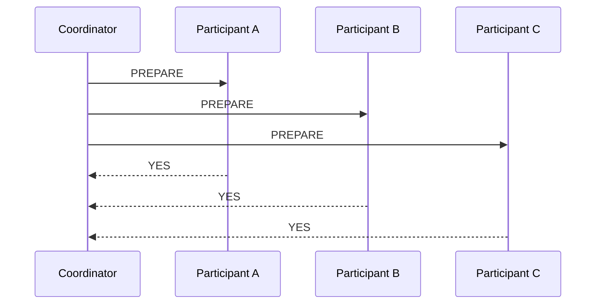
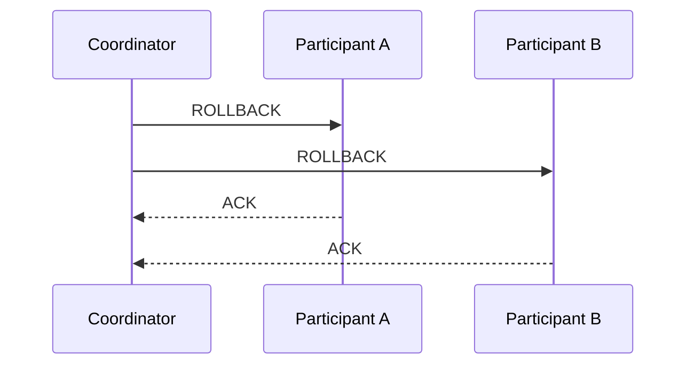
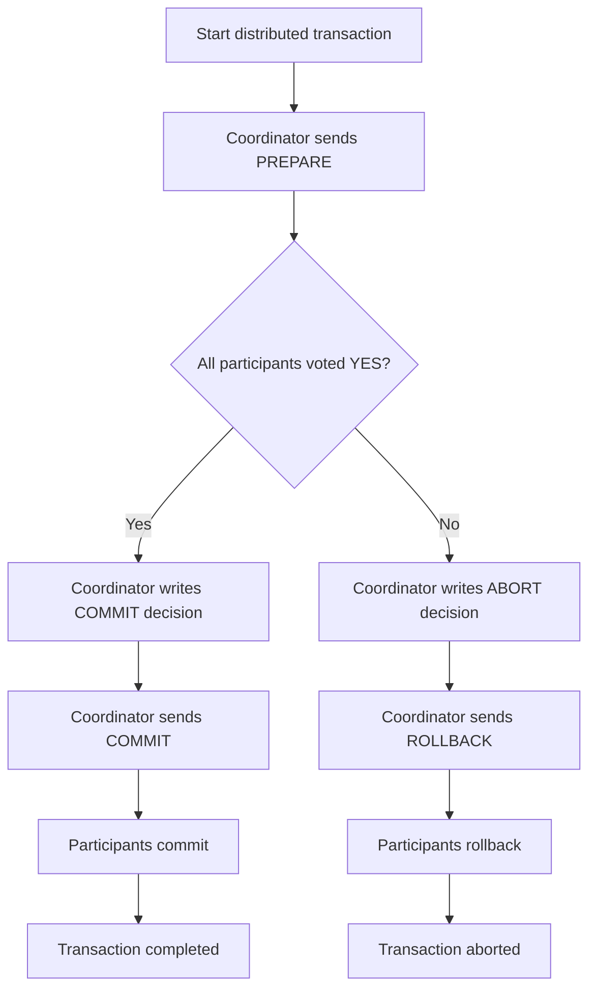

![[Pasted image 20260712201848.png]]

**Two-Phase Commit**, или **2PC**, — это протокол распределённой транзакции, который позволяет нескольким участникам либо **всем вместе зафиксировать изменения**, либо **всем вместе откатиться**.

Главная цель:

```text
Все участники сделали COMMIT
или
все участники сделали ROLLBACK
```

2PC пытается обеспечить атомарность в распределённой системе.

Пример:

```text
Нужно списать деньги в одной базе
и зачислить деньги в другой базе.

Если списание прошло, а зачисление нет — плохо.
Нужно, чтобы обе операции либо завершились успешно, либо обе отменились.
```

---

# 1. Участники 2PC

В 2PC есть две основные роли.

### Coordinator

**Coordinator** — координатор транзакции.

Он управляет процессом:

- спрашивает участников, готовы ли они зафиксировать изменения;
- принимает финальное решение;
- рассылает команду `COMMIT` или `ROLLBACK`.

### Participants

**Participants** — участники транзакции.

Это могут быть:

- базы данных;
- очереди сообщений;
- сервисы;
- transaction managers;
- любые ресурсы, участвующие в распределённой транзакции.

Пример:

```text
Coordinator
 ├── Orders DB
 ├── Payments DB
 └── Inventory DB
```

---

# 2. Зачем нужен 2PC

Обычная транзакция в одной базе:

```sql
BEGIN;

UPDATE accounts SET balance = balance - 100 WHERE id = 1;
UPDATE accounts SET balance = balance + 100 WHERE id = 2;

COMMIT;
```

Всё происходит внутри одной БД.

Но если данные лежат в разных системах:

```text
Bank A DB
Bank B DB
```

одна обычная транзакция уже не поможет.

2PC решает это через две фазы:

```text
Phase 1: Prepare / Voting
Phase 2: Commit / Abort
```

---

# 3. Фаза 1 — Prepare / Voting

На первой фазе координатор спрашивает всех участников:

```text
Вы готовы зафиксировать транзакцию?
```

Каждый участник выполняет локальную подготовку:

- проверяет, может ли выполнить изменения;
- делает нужные блокировки;
- записывает состояние в журнал;
- готовит транзакцию к коммиту;
- отвечает `YES` или `NO`.



Если все ответили `YES`, координатор может переходить к коммиту.

Если хотя бы один ответил `NO`, вся транзакция должна быть отменена.

---

# 4. Фаза 2 — Commit / Abort

На второй фазе координатор принимает финальное решение.

## Если все ответили YES

Координатор отправляет всем:

```text
COMMIT
```


## Если хотя бы один ответил NO

Координатор отправляет всем:

```text
ROLLBACK
```



---

# 5. Полная схема 2PC



---

# 6. Пример из жизни

Допустим, интернет-магазин должен:

1. Создать заказ в `orders_db`.
2. Списать деньги в `payments_db`.
3. Уменьшить остаток товара в `inventory_db`.

2PC работает так:

```text
Coordinator:
  "Orders DB, ты готов?"
  "Payments DB, ты готов?"
  "Inventory DB, ты готов?"

Orders DB: YES
Payments DB: YES
Inventory DB: YES

Coordinator:
  "Все коммитим"
```

Если `Payments DB` отвечает `NO`:

```text
Coordinator:
  "Все откатываемся"
```

---

# 9. Псевдокод координатора

```python
class Coordinator:
    def __init__(self, participants: list) -> None:
        self.participants = participants

    def run_transaction(self) -> None:
        prepared_participants = []

        try:
            for participant in self.participants:
                vote = participant.prepare()

                if vote != "YES":
                    raise RuntimeError("Participant voted NO")

                prepared_participants.append(participant)

            self.write_decision_to_log("COMMIT")

            for participant in prepared_participants:
                participant.commit()

        except Exception:
            self.write_decision_to_log("ROLLBACK")

            for participant in prepared_participants:
                participant.rollback()

            raise

    def write_decision_to_log(self, decision: str) -> None:
        print(f"Decision saved: {decision}")
```

---

# 10. Псевдокод участника

```python
class Participant:
    def __init__(self, name: str) -> None:
        self.name = name
        self.prepared = False

    def prepare(self) -> str:
        print(f"{self.name}: prepare")

        try:
            self.lock_resources()
            self.write_prepare_log()
            self.prepared = True
            return "YES"
        except Exception:
            return "NO"

    def commit(self) -> None:
        print(f"{self.name}: commit")
        self.apply_changes()
        self.release_locks()
        self.prepared = False

    def rollback(self) -> None:
        print(f"{self.name}: rollback")
        self.undo_changes()
        self.release_locks()
        self.prepared = False

    def lock_resources(self) -> None:
        pass

    def write_prepare_log(self) -> None:
        pass

    def apply_changes(self) -> None:
        pass

    def undo_changes(self) -> None:
        pass

    def release_locks(self) -> None:
        pass
```

---

# 11. Главная проблема 2PC — блокировки

2PC — блокирующий протокол.

Если участник ответил `YES` на prepare, он обычно должен держать ресурсы до финального решения.

Проблема:

```text
Participant ответил YES
Coordinator упал
Participant не знает, делать COMMIT или ROLLBACK
Participant ждёт
Ресурсы заблокированы
```

Это может приводить к:

- долгим блокировкам;
- задержкам;
- снижению пропускной способности;
- зависшим транзакциям;
- ручному вмешательству администратора.

---

# 15. Failure scenarios

## Сценарий 1. Участник упал до prepare

```text
Coordinator отправил PREPARE
Participant не ответил
```

Координатор по timeout принимает решение:

```text
ROLLBACK
```

## Сценарий 2. Участник ответил NO

```text
Participant B: NO
```

Координатор отправляет всем:

```text
ROLLBACK
```

## Сценарий 3. Координатор упал до решения

Если участники ещё не голосовали `YES`, обычно можно откатиться.

Но если участник уже в состоянии `PREPARED`, он не может безопасно решить сам.

## Сценарий 4. Координатор упал после решения COMMIT

Если координатор успел записать `COMMIT` в durable log, после восстановления он продолжит рассылать `COMMIT`.

## Сценарий 5. Участник упал после prepare

После рестарта он видит в своём логе:

```text
PREPARED
```

Он должен спросить координатора:

```text
Что было решено: COMMIT или ROLLBACK?
```

## Сценарий 6. ACK потерялся

Координатор может повторно отправить `COMMIT` или `ROLLBACK`.

Поэтому эти операции должны быть идемпотентными.

---

# 16. Idempotency в 2PC

Даже в 2PC операции должны выдерживать повторы сообщений.

```text
Coordinator отправил COMMIT
Participant сделал COMMIT
ACK потерялся
Coordinator снова отправил COMMIT
```

Участник не должен ломаться от повторного `COMMIT`.

Пример:

```python
def commit(transaction_id: str) -> None:
    state = get_transaction_state(transaction_id)

    if state == "COMMITTED":
        return

    if state != "PREPARED":
        raise RuntimeError("Cannot commit non-prepared transaction")

    apply_commit(transaction_id)
    mark_committed(transaction_id)
```

---

# 17. Timeout в 2PC

Timeout помогает не ждать бесконечно.

Например:

```text
Coordinator отправил PREPARE
Participant не отвечает 30 секунд
Coordinator решает ROLLBACK
```

Но timeout не решает главную проблему, когда участник уже в состоянии `PREPARED` и ждёт финального решения.

В состоянии `PREPARED` участник не всегда может сам решить, что делать.

---

# 18. Пример 2PC через PostgreSQL prepared transactions

PostgreSQL поддерживает prepared transactions.

Это похоже на фазу `prepare` в 2PC.

## Важно

В PostgreSQL нужно включить `max_prepared_transactions`.

Проверка:

```sql
SHOW max_prepared_transactions;
```

Если значение `0`, prepared transactions выключены.

---

## Участник 1

```sql
BEGIN;

UPDATE accounts
SET balance = balance - 100
WHERE id = 1;

PREPARE TRANSACTION 'tx_123_participant_1';
```

Теперь транзакция подготовлена, но ещё не закоммичена.

---

## Участник 2

```sql
BEGIN;

UPDATE accounts
SET balance = balance + 100
WHERE id = 2;

PREPARE TRANSACTION 'tx_123_participant_2';
```

---

## Координатор принимает решение COMMIT

```sql
COMMIT PREPARED 'tx_123_participant_1';
COMMIT PREPARED 'tx_123_participant_2';
```

---

## Если координатор принимает ROLLBACK

```sql
ROLLBACK PREPARED 'tx_123_participant_1';
ROLLBACK PREPARED 'tx_123_participant_2';
```

---

## Посмотреть prepared transactions

```sql
SELECT *
FROM pg_prepared_xacts;
```

> [!warning]
> Зависшие prepared transactions могут держать блокировки и мешать VACUUM.  
> Их нельзя оставлять без контроля.

---

# 19. Пример 2PC на уровне HTTP-сервисов

В реальной микросервисной архитектуре 2PC через HTTP обычно плохая идея, но как учебный пример полезно.

## Participant API

```http
POST /transactions/{tx_id}/prepare
POST /transactions/{tx_id}/commit
POST /transactions/{tx_id}/rollback
```

## Координатор

```python
import requests


class HttpParticipant:
    def __init__(self, base_url: str) -> None:
        self.base_url = base_url

    def prepare(self, tx_id: str) -> bool:
        response = requests.post(f"{self.base_url}/transactions/{tx_id}/prepare")
        return response.status_code == 200

    def commit(self, tx_id: str) -> None:
        requests.post(f"{self.base_url}/transactions/{tx_id}/commit")

    def rollback(self, tx_id: str) -> None:
        requests.post(f"{self.base_url}/transactions/{tx_id}/rollback")


def run_2pc(tx_id: str, participants: list[HttpParticipant]) -> None:
    prepared = []

    try:
        for participant in participants:
            if not participant.prepare(tx_id):
                raise RuntimeError("Prepare failed")

            prepared.append(participant)

        for participant in prepared:
            participant.commit(tx_id)

    except Exception:
        for participant in prepared:
            participant.rollback(tx_id)

        raise
```

Проблема такого подхода:

- сервисы держат ресурсы;
- сетевые сбои приводят к подвисшим состояниям;
- нужен durable log;
- нужно восстановление после падений;
- это сильно усложняет микросервисы.

---

# 20. 2PC vs Outbox

| Критерий | 2PC | Outbox |
|---|---|---|
| Идея | одна распределённая транзакция | локальная транзакция + отложенная публикация |
| Блокировки | могут быть долгими | только локальная транзакция |
| Сложность инфраструктуры | высокая | средняя |
| Поддержка брокера | нужен XA/2PC | не обязательно |
| Масштабируемость | хуже | лучше |
| Eventual consistency | меньше | да |
| Популярность в микросервисах | ниже | выше |

---

# 21. 2PC vs Saga

| Критерий | 2PC | Saga |
|---|---|---|
| Цель | атомарный commit/rollback | бизнес-согласованность через компенсации |
| Подход | пессимистичный | оптимистичный |
| Блокировки | держит ресурсы | не держит долго |
| Согласованность | сильная | eventual consistency |
| Откат | технический rollback | бизнес-компенсации |
| Производительность | ниже | выше |
| Сложность бизнес-логики | ниже | выше |
| Подходит для long-running процессов | плохо | хорошо |
| Подходит для микросервисов | часто плохо | часто хорошо |

---

# 22. Когда 2PC уместен

2PC может быть уместен, если:

- ресурсы поддерживают 2PC/XA;
- участников мало;
- транзакции короткие;
- нужна строгая атомарность;
- система находится в контролируемой инфраструктуре;
- допустимы блокировки;
- нет long-running бизнес-процесса.

Примеры:

- enterprise Java-приложение с JTA;
- две базы внутри одного дата-центра;
- финансовая операция, где нельзя принять eventual consistency;
- короткая транзакция между XA-совместимыми ресурсами.

---

# 25. Когда 2PC лучше не использовать

2PC обычно плохо подходит, если:

- много микросервисов;
- сервисы общаются через сеть;
- процесс может длиться минуты, часы или дни;
- участники ненадёжны или независимы;
- важна высокая доступность;
- важна масштабируемость;
- нельзя долго держать блокировки;
- часть ресурсов не поддерживает XA;
- есть внешние API.

В таких случаях чаще выбирают:

```text
Saga
Outbox
Inbox
event-driven architecture
idempotency
retries
compensating actions
```

---

# 26. CAP и 2PC

2PC пытается дать сильную согласованность между участниками.

Но в распределённой системе при сетевых проблемах возникает выбор:

```text
ждать и блокироваться
или
отказаться от операции
```

Поэтому 2PC часто снижает доступность.

Если координатор или участник недоступен, транзакция может зависнуть в неопределённом состоянии.

---

# 27. Почему 2PC называют blocking protocol

Потому что участник в состоянии `PREPARED` не может самостоятельно безопасно решить:

```text
COMMIT или ROLLBACK?
```

Он уже пообещал координатору, что готов коммитить.  
Если координатор исчез, участник вынужден ждать его решения или восстановления.

---

# 28. Three-Phase Commit

Существует **Three-Phase Commit**, или **3PC**.

Он добавляет дополнительную фазу, чтобы уменьшить блокировки.

Упрощённо:

```text
CanCommit?
PreCommit
DoCommit
```

Но на практике 3PC сложнее, требует более строгих сетевых предположений и встречается заметно реже.

В большинстве современных систем чаще обсуждают:

```text
2PC vs Saga
2PC vs Outbox
```

---

# 30. Ответ для собеседования

## Короткий ответ

> 2PC — это протокол распределённой транзакции.  
> В первой фазе координатор спрашивает всех участников, готовы ли они к коммиту.  
> Если все ответили YES, во второй фазе он отправляет COMMIT.  
> Если кто-то ответил NO или не ответил, он отправляет ROLLBACK.  
> Главный минус — блокировки и зависимость от координатора.

## Сильный ответ

> Two-Phase Commit нужен, чтобы обеспечить атомарный commit между несколькими транзакционными ресурсами.  
> Есть координатор и участники.  
> На фазе prepare участники выполняют локальную подготовку, записывают состояние в durable log, блокируют нужные ресурсы и голосуют YES или NO.  
> Если все проголосовали YES, координатор записывает решение COMMIT и рассылает commit.  
> Если кто-то проголосовал NO или произошёл timeout, координатор принимает ABORT и рассылает rollback.  
> Основная проблема 2PC в том, что это blocking protocol: если участник уже prepared, а координатор упал, участник может держать блокировки и ждать финального решения.  
> Поэтому в микросервисах часто предпочитают Saga, Outbox и eventual consistency, особенно для long-running бизнес-процессов.
