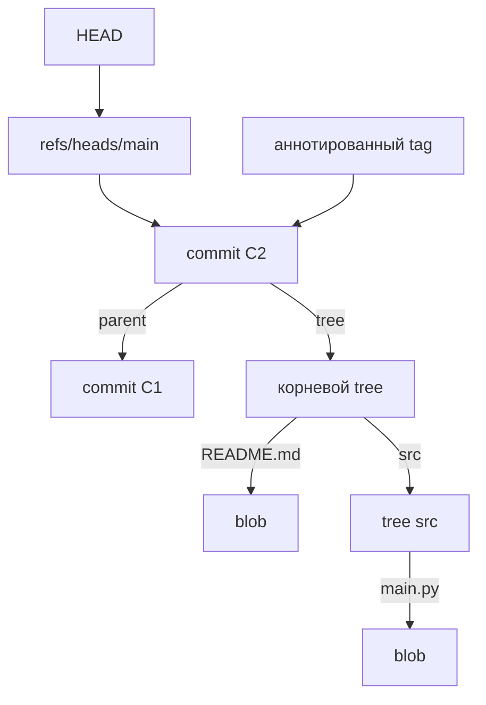
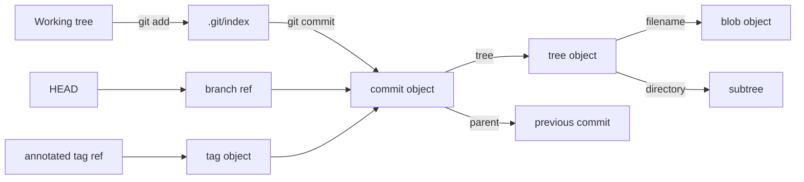

# Внутреннее устройство каталога `.git`

## Что такое `.git`

Каталог `.git` — это локальная база данных репозитория Git. В нём хранятся:

- все сохранённые версии файлов;
- коммиты и связи между ними;
- ветки и теги;
- индекс, то есть staging area;
- настройки репозитория;
- журнал перемещения ссылок — reflog;
- служебное состояние операций `merge`, `rebase`, `cherry-pick` и других.

Рабочие файлы проекта находятся рядом с `.git`, а сама история проекта — внутри `.git`.

> [!important]
> Ветка — это не отдельная копия файлов. Обычно ветка представляет собой небольшую ссылку на один commit-объект.

---

## Три состояния данных в Git

Git удобно рассматривать как систему из трёх областей:

| Область | Что содержит |
|---|---|
| Working tree | Файлы, с которыми разработчик работает сейчас |
| Index / staging area | Подготовленный снимок следующего коммита |
| Repository | Объекты и история внутри `.git` |

Упрощённый поток данных:

```text
Рабочая директория
      │
      │ git add
      ▼
.git/index
      │
      │ git commit
      ▼
.git/objects + refs
```

---

# Основные элементы `.git`

Пример структуры:

```text
.git/
├── HEAD
├── config
├── index
├── objects/
│   ├── 3b/
│   ├── info/
│   └── pack/
├── refs/
│   ├── heads/
│   ├── remotes/
│   └── tags/
├── logs/
│   ├── HEAD
│   └── refs/
├── hooks/
├── info/
├── packed-refs
├── ORIG_HEAD
├── MERGE_HEAD
└── FETCH_HEAD
```

Не каждый файл присутствует постоянно. Некоторые появляются только во время определённых операций.

## `.git/HEAD`

`HEAD` показывает, где сейчас находится пользователь.

Обычно он содержит символическую ссылку на текущую ветку:

```text
ref: refs/heads/main
```

Это означает:

```text
HEAD → refs/heads/main → commit
```

Прочитать:

```bash
cat .git/HEAD
```

Получить итоговый commit, на который указывает `HEAD`:

```bash
git rev-parse HEAD
```

### Detached HEAD

Иногда `HEAD` содержит непосредственно хеш коммита:

```text
8c31f7a...
```

Такое состояние называется **detached HEAD**. Пользователь находится на конкретном коммите, а не на ветке.

---

## `.git/config`

Локальные настройки конкретного репозитория:

```ini
[core]
    repositoryformatversion = 0
    bare = false

[remote "origin"]
    url = git@github.com:user/project.git
    fetch = +refs/heads/*:refs/remotes/origin/*
```

Посмотреть настройки:

```bash
git config --local --list
```

Посмотреть настройки вместе с файлами, из которых они были загружены:

```bash
git config --list --show-origin
```

---

## `.git/index`

`index` — бинарный файл, представляющий staging area.

Он связывает пути файлов с blob-объектами, которые должны попасть в следующий коммит.

Упрощённо:

```text
README.md → blob a123...
src/main.py → blob b456...
```

Посмотреть содержимое индекса:

```bash
git ls-files --stage
```

Пример:

```text
100644 3b263d9e50db0310c7ff036b7aef0a158c26d3fa 0    note.txt
```

Здесь:

- `100644` — режим файла;
- `3b263d...` — идентификатор blob-объекта;
- `0` — стадия записи индекса;
- `note.txt` — путь файла.

> [!note]
> `git add` не просто «помечает файл». Команда создаёт blob для текущего содержимого файла и записывает его хеш в `.git/index`.

---

## `.git/objects`

Это объектная база данных Git. В ней хранятся четыре основных типа объектов:

1. `blob`;
2. `tree`;
3. `commit`;
4. `tag`.

Git является **content-addressable storage**: объект находится по идентификатору, вычисленному из его содержимого.

---

# Типы объектов Git

## 1. Blob

`blob` хранит содержимое файла как последовательность байтов.

Blob не хранит:

- имя файла;
- путь файла;
- дату изменения;
- автора;
- расширение файла.

Например, файлы `a.txt` и `copy.txt` с одинаковым содержимым будут ссылаться на один и тот же blob.

Посмотреть тип объекта:

```bash
git cat-file -t <object>
```

Посмотреть размер:

```bash
git cat-file -s <object>
```

Вывести содержимое:

```bash
git cat-file -p <blob-hash>
```

---

## 2. Tree

`tree` описывает содержимое каталога.

Он хранит записи вида:

```text
режим  тип  хеш  имя
```

Пример:

```text
100644 blob 3b263d... note.txt
100755 blob a81c02... script.sh
040000 tree f5e244... src
```

Именно tree связывает имя файла с blob-объектом:

```text
note.txt → blob 3b263d...
```

Tree может ссылаться:

- на blob — обычный файл или символическую ссылку;
- на другой tree — вложенный каталог;
- на commit — запись submodule.

Часто встречающиеся режимы:

| Режим | Значение |
|---|---|
| `100644` | Обычный неисполняемый файл |
| `100755` | Исполняемый файл |
| `040000` | Каталог, то есть tree |
| `120000` | Символическая ссылка |
| `160000` | Git submodule |

Посмотреть tree:

```bash
git cat-file -p <tree-hash>
```

Или в более удобном формате:

```bash
git ls-tree <tree-or-commit>
```

Рекурсивный просмотр:

```bash
git ls-tree -r HEAD
```

---

## 3. Commit

`commit` описывает один снимок проекта и его место в истории.

Пример содержимого:

```text
tree 936d21...
parent 1a12e8...
author Ilya <ilya@example.com> 1784790000 +0400
committer Ilya <ilya@example.com> 1784790060 +0400

Add configuration file
```

Commit хранит:

- ссылку на корневой tree;
- ссылку на родительский commit или несколько родителей;
- автора изменения;
- коммиттера;
- время автора и коммиттера;
- сообщение коммита.

### Commit хранит снимок, а не diff

Commit указывает на корневой tree, описывающий полное состояние проекта в этот момент.

Разница между коммитами вычисляется при сравнении их деревьев:

```bash
git diff <commit-1> <commit-2>
```

### Родители коммита

Обычный commit имеет одного родителя:

```text
commit B → parent A
```

Первый commit не имеет родителей.

Merge commit обычно имеет двух или более родителей:

```text
        B
       / \
      A   M
       \ /
        C
```

Посмотреть commit-объект:

```bash
git cat-file -p HEAD
```

Более привычный вывод:

```bash
git show --format=fuller HEAD
```

---

## Автор и коммиттер

В commit-объекте есть две отдельные роли.

### Author

Человек, который изначально подготовил изменение.

### Committer

Человек, который создал данный commit-объект в текущей истории.

Чаще всего это один человек. Они могут отличаться после:

- применения чужого patch;
- `git am`;
- `git cherry-pick`;
- `git rebase`;
- принятия изменения сопровождающим проекта.

Посмотреть обе роли и даты:

```bash
git show -s --format=fuller HEAD
```

---

## 4. Tag object

Объект `tag` создаётся для **аннотированного тега**.

Пример:

```text
object cdf420...
type commit
tag v1.0.0
tagger Ilya <ilya@example.com> 1784791000 +0400

First stable release
```

Tag object может содержать:

- ссылку на другой объект;
- тип целевого объекта;
- имя тега;
- автора тега;
- дату;
- сообщение;
- цифровую подпись.

### Lightweight tag

Легковесный тег не создаёт tag-объект. Это просто ссылка в `refs/tags/`, обычно непосредственно на commit.

---

# Связь между объектами

Основная модель Git:



Другой способ представить структуру:

```text
HEAD
└── refs/heads/main
    └── commit
        ├── parent → предыдущий commit
        └── tree → корневой каталог
            ├── README.md → blob
            ├── config.yml → blob
            └── src → tree
                ├── main.py → blob
                └── utils.py → blob
```

Главные правила:

- `HEAD` обычно указывает на ветку;
- ветка указывает на commit;
- commit указывает на корневой tree;
- tree связывает имена и пути с объектами;
- tree указывает на blobs и вложенные trees;
- commit указывает на родительские commits;
- аннотированный tag обычно указывает на commit.

---

# Как объекты хранятся физически

## Loose objects

Отдельно сохранённый объект называется **loose object**.

Допустим, хеш объекта:

```text
3b263d9e50db0310c7ff036b7aef0a158c26d3fa
```

Его путь:

```text
.git/objects/3b/263d9e50db0310c7ff036b7aef0a158c26d3fa
```

Правило:

```text
первые 2 символа хеша → имя каталога
оставшиеся символы   → имя файла
```

Это делается, чтобы не хранить все объекты в одном каталоге.

## Формат объекта до сжатия

Перед сохранением Git формирует структуру:

```text
<type> <size>\0<content>
```

Для blob с содержимым `blablabla\n`:

```text
blob 10\0blablabla\n
```

Где:

- `blob` — тип;
- `10` — размер содержимого в байтах;
- `\0` — нулевой байт;
- далее идут данные объекта.

Затем Git:

1. вычисляет хеш от заголовка и содержимого;
2. сжимает объект через zlib;
3. сохраняет сжатые байты в `.git/objects`.

Поэтому обычный `cat` выводит нечитаемые символы:

```bash
cat .git/objects/3b/263d9e50db0310c7ff036b7aef0a158c26d3fa
```

Посмотреть сжатые байты в hex:

```bash
xxd .git/objects/3b/263d9e50db0310c7ff036b7aef0a158c26d3fa
```

## Ручная распаковка loose object

```bash
python - <<'PY'
import zlib
from pathlib import Path

path = Path(
    ".git/objects/3b/"
    "263d9e50db0310c7ff036b7aef0a158c26d3fa"
)

compressed = path.read_bytes()
raw = zlib.decompress(compressed)

print(repr(raw))
PY
```

Пример результата:

```text
b'blob 10\x00blablabla\n'
```

Разделить заголовок и содержимое:

```bash
python - <<'PY'
import sys
import zlib
from pathlib import Path

path = Path(
    ".git/objects/3b/"
    "263d9e50db0310c7ff036b7aef0a158c26d3fa"
)

raw = zlib.decompress(path.read_bytes())
header, content = raw.split(b"\0", 1)

print("Header:", header.decode())
print("Content:")
sys.stdout.buffer.write(content)
PY
```

---

## Packfiles

Со временем Git объединяет множество объектов в pack-файлы:

```text
.git/objects/pack/
├── pack-abc123.pack
└── pack-abc123.idx
```

| Файл | Назначение |
|---|---|
| `.pack` | Содержит множество упакованных объектов |
| `.idx` | Позволяет быстро найти объект внутри `.pack` по хешу |

В pack-файлах Git может хранить объект полностью или как delta относительно похожего объекта. Это уменьшает объём репозитория.

Создать pack-файлы вручную обычно можно через:

```bash
git gc
```

Статистика объектной базы:

```bash
git count-objects -vH
```

Посмотреть содержимое pack index:

```bash
git verify-pack -v .git/objects/pack/*.idx
```

> [!important]
> Если loose-файла по пути `.git/objects/xx/...` нет, это не означает, что объект потерян. Он может находиться внутри pack-файла.

---

# Ссылки: `refs`

Объекты создают граф истории, а refs дают удобные имена отдельным точкам этого графа.

## Локальные ветки

```text
.git/refs/heads/main
.git/refs/heads/develop
```

Файл ветки обычно содержит хеш коммита:

```bash
cat .git/refs/heads/main
```

Лучше использовать Git-команды:

```bash
git rev-parse main
git show-ref --heads
```

## Remote-tracking branches

```text
.git/refs/remotes/origin/main
```

Это локальные ссылки, отражающие последнее известное состояние веток удалённого репозитория.

Они не являются самими удалёнными ветками.

## Теги

```text
.git/refs/tags/v1.0.0
```

Посмотреть ссылки:

```bash
git show-ref
```

## `packed-refs`

Git может объединить множество refs в файл:

```text
.git/packed-refs
```

Поэтому отсутствие отдельного файла в `.git/refs/` не всегда означает отсутствие ветки или тега.

Для чтения ссылок надёжнее использовать:

```bash
git show-ref
git for-each-ref
```

---

# Reflog: `.git/logs`

Reflog хранит историю изменения ссылок в локальном репозитории.

Примеры:

```text
.git/logs/HEAD
.git/logs/refs/heads/main
```

Reflog позволяет увидеть, куда раньше указывали `HEAD` и ветки:

```bash
git reflog
```

Пример:

```text
8f8d9a1 HEAD@{0}: commit: Add parser
31a82e0 HEAD@{1}: checkout: moving from develop to main
```

Reflog полезен для восстановления после:

- случайного `reset --hard`;
- неудачного rebase;
- удаления ветки;
- перемещения `HEAD`.

> [!note]
> Reflog является локальной историей. Он обычно не передаётся через `push` и `fetch`.

---

# Служебные ссылки и состояния

Некоторые файлы появляются только при выполнении операций.

| Файл или каталог | Назначение |
|---|---|
| `ORIG_HEAD` | Предыдущее важное положение `HEAD` |
| `MERGE_HEAD` | Commit, который сейчас сливается в текущую ветку |
| `CHERRY_PICK_HEAD` | Commit, применяемый через cherry-pick |
| `REVERT_HEAD` | Commit, для которого выполняется revert |
| `FETCH_HEAD` | Результаты последнего fetch |
| `rebase-merge/` | Состояние выполняемого rebase |
| `rebase-apply/` | Состояние rebase или применения patch |

Эти данные позволяют Git продолжить, отменить или корректно завершить операцию.

---

# Hooks

Каталог:

```text
.git/hooks/
```

содержит скрипты, которые Git может запускать при определённых событиях.

Примеры:

- `pre-commit`;
- `commit-msg`;
- `pre-push`;
- `post-merge`;
- `post-checkout`.

После `git init` обычно создаются примеры с расширением `.sample`.

Чтобы hook заработал, он должен иметь нужное имя и право на выполнение:

```bash
chmod +x .git/hooks/pre-commit
```

---

# Как пройти от `HEAD` до содержимого файла

Это главный практический алгоритм чтения внутренней структуры Git.

## Шаг 1. Узнать текущую ветку

```bash
cat .git/HEAD
```

Результат:

```text
ref: refs/heads/main
```

## Шаг 2. Получить commit текущей ветки

```bash
git rev-parse HEAD
```

Результат:

```text
abc123...
```

## Шаг 3. Прочитать commit

```bash
git cat-file -p HEAD
```

Найти строку:

```text
tree def456...
```

## Шаг 4. Прочитать корневой tree

```bash
git ls-tree def456
```

Результат:

```text
100644 blob 3b263d...    note.txt
040000 tree 7af018...    src
```

## Шаг 5. Прочитать blob

```bash
git cat-file -p 3b263d
```

Git найдёт объект по хешу, распакует его и выведет содержимое.

Полная цепочка:

```text
HEAD
  ↓
refs/heads/main
  ↓
commit
  ↓
tree
  ↓
blob
  ↓
содержимое файла
```

---

# Полезные команды для исследования объектов

## Определить тип объекта

```bash
git cat-file -t <object>
```

## Определить размер объекта

```bash
git cat-file -s <object>
```

## Вывести объект

```bash
git cat-file -p <object>
```

`<object>` может быть не только полным хешем:

```bash
git cat-file -p HEAD
git cat-file -p main
git cat-file -p HEAD^{tree}
git cat-file -p HEAD:README.md
```

## Преобразовать имя ссылки в хеш

```bash
git rev-parse HEAD
git rev-parse main
git rev-parse HEAD~1
```

## Посмотреть дерево файлов

```bash
git ls-tree HEAD
git ls-tree -r HEAD
```

## Получить blob конкретного файла

```bash
git rev-parse HEAD:README.md
```

Вывести содержимое файла из коммита:

```bash
git show HEAD:README.md
```

## Посмотреть index

```bash
git ls-files --stage
```

## Посмотреть все refs

```bash
git show-ref
```

## Посмотреть reflog

```bash
git reflog
```

## Проверить целостность объектной базы

```bash
git fsck --full
```

Команда может показать:

- повреждённые объекты;
- отсутствующие объекты;
- недостижимые commits;
- dangling blobs, trees и commits.

## Посмотреть статистику объектов

```bash
git count-objects -vH
```

## Создать blob вручную

Вычислить хеш без записи:

```bash
printf 'hello\n' | git hash-object --stdin
```

Создать объект в `.git/objects`:

```bash
printf 'hello\n' | git hash-object -w --stdin
```

---

# Как Git находит объект по хешу

Хеш-функция необратима. Git не восстанавливает содержимое математически из хеша.

Хеш используется как ключ базы данных:

```text
object ID → сохранённый объект
```

Для loose object Git преобразует хеш в путь:

```text
3b263d... → .git/objects/3b/263d...
```

Для packed object Git использует `.idx`, чтобы определить позицию объекта внутри `.pack`.

После нахождения Git:

1. читает сохранённые байты;
2. распаковывает объект;
3. при необходимости восстанавливает delta;
4. проверяет тип и размер;
5. выводит содержимое.

Если самого объекта нигде нет, один хеш не позволяет восстановить исходные данные.

---

# Почему изменение файла создаёт новый blob

Хеш зависит от содержимого объекта. Даже небольшое изменение приводит к другому идентификатору.

```text
hello\n  → blob A
hello!\n → blob B
```

Tree нового коммита будет ссылаться на новый blob. Неизменившиеся файлы могут продолжать ссылаться на старые blobs.

Пример:

```text
commit A → tree A
             ├── main.py → blob X
             └── readme  → blob Y

commit B → tree B
             ├── main.py → blob Z  ← файл изменился
             └── readme  → blob Y  ← объект переиспользован
```

Именно поэтому Git не обязан копировать весь проект для каждого коммита.

---

# Достижимость объектов

Объект считается **достижимым**, если до него можно пройти от какой-либо ссылки:

```text
ref → commit → tree → blob
```

Примеры корней достижимости:

- локальные ветки;
- remote-tracking refs;
- теги;
- некоторые служебные refs;
- reflog.

Если объект больше ниоткуда не достижим, он может позже быть удалён сборщиком мусора:

```bash
git gc
git prune
```

Поэтому удалённый commit иногда ещё можно восстановить через reflog, пока соответствующие объекты не были очищены.

---

# Что не является Git-объектом

Важно не смешивать объекты и служебные структуры.

| Сущность | Git-объект? | Где хранится |
|---|---:|---|
| Содержимое файла | Да, `blob` | `objects/` |
| Каталог снимка | Да, `tree` | `objects/` |
| Коммит | Да, `commit` | `objects/` |
| Аннотированный тег | Да, `tag` | `objects/` |
| Ветка | Нет | `refs/heads/` или `packed-refs` |
| Lightweight tag | Нет | `refs/tags/` или `packed-refs` |
| `HEAD` | Нет | `.git/HEAD` |
| Staging area | Нет | `.git/index` |
| Reflog | Нет | `.git/logs/` |
| Настройки | Нет | `.git/config` |

---

# Краткая итоговая схема



## Главное, что нужно запомнить

1. `.git` — база данных и служебное состояние репозитория.
2. Git хранит объекты `blob`, `tree`, `commit` и `tag`.
3. Blob хранит только байты файла, но не его имя.
4. Tree хранит имена и связывает их с blobs и вложенными trees.
5. Commit ссылается на корневой tree и родительские commits.
6. Ветка — это ссылка на commit, а не отдельная история файлов.
7. `HEAD` обычно указывает на текущую ветку.
8. Index содержит подготовленный снимок следующего коммита.
9. Loose objects сжаты zlib и лежат по пути, построенному из хеша.
10. Старые объекты могут быть объединены в pack-файлы.
11. Хеш не расшифровывается — он используется для поиска сохранённого объекта.
12. `git cat-file`, `git ls-tree`, `git rev-parse` и `git ls-files` позволяют исследовать внутреннее устройство репозитория.
