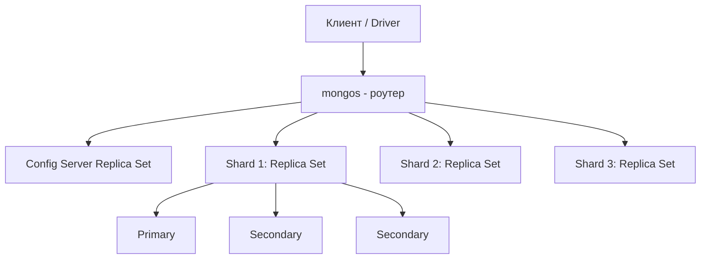

# MongoDB — архитектура, сущности, CRUD, индексы

## 1. Что такое MongoDB

MongoDB — документоориентированная NoSQL СУБД. Данные хранятся не в строках таблиц, а в **документах** формата BSON (бинарный JSON), которые группируются в **коллекции**. Схема документов гибкая: у разных документов одной коллекции могут быть разные поля.

---

## 2. Архитектура

### 2.1 Уровни процесса



Ключевые процессы:

- **mongod** — основной процесс сервера, хранит данные и обслуживает операции. Может быть частью replica set или отдельного шарда.
- **mongos** — роутер запросов в шардированном кластере. Сам данные не хранит, знает, на каком шарде лежит нужный chunk, и проксирует запрос.
- **config servers** — отдельный replica set, хранящий метаданные шардирования: карту распределения чанков по шардам, конфигурацию кластера.

### 2.2 Storage Engine

По умолчанию — **WiredTiger**:
- MVCC (multi-version concurrency control) — читатели не блокируют писателей.
- Компрессия данных и индексов (snappy/zlib/zstd).
- Документ-level locking (а не блокировка всей коллекции/базы).
- Журнал (journal) для durability — WAL-подобный механизм для восстановления после сбоя.

### 2.3 Replica Set (репликация)

Группа mongod-процессов, хранящих одинаковые данные:

- **Primary** — принимает все операции записи (по умолчанию и чтения).
- **Secondary** — реплицирует данные с primary через **oplog** (capped-коллекция `local.oplog.rs`, журнал всех write-операций).
- **Arbiter** — не хранит данные, участвует только в голосовании при выборах нового primary.

При падении primary кластер проводит **election** (на основе протокола Raft-подобного консенсуса) и выбирает нового primary среди secondary с наиболее свежими данными.

Read/Write Concern и Read Preference:
- `writeConcern` — сколько узлов должны подтвердить запись (`w: 1`, `w: "majority"`).
- `readConcern` — какие данные считаются "достаточно подтверждёнными" для чтения (`local`, `majority`, `linearizable`).
- `readPreference` — откуда читать: `primary`, `primaryPreferred`, `secondary`, `secondaryPreferred`, `nearest`.

### 2.4 Sharding (горизонтальное масштабирование)

Данные коллекции разбиваются на **чанки (chunks)** по диапазонам/хэшам **shard key** и распределяются между шардами (каждый шард сам по себе — replica set).

- **Shard key** — поле(я), по которым идёт разбиение. От выбора shard key зависит равномерность распределения нагрузки (важно избегать "горячих" шардов — monotonically increasing key типа `_id` даёт плохое распределение при range-шардировании).
- **Chunk** — диапазон значений shard key, единица миграции между шардами.
- **Balancer** — фоновый процесс, перераспределяющий чанки между шардами для равномерной нагрузки.
- Стратегии: **ranged sharding** (диапазоны значений) и **hashed sharding** (хэш от значения — лучше для равномерности, хуже для range-запросов).

---

## 3. Основные сущности

| Сущность | Аналог в реляционной БД | Описание |
|---|---|---|
| Database | База данных | Логический контейнер коллекций |
| Collection | Таблица | Набор документов, схема не фиксирована |
| Document | Строка | BSON-объект, аналог JSON-объекта с типами (ObjectId, Date, Decimal128 и т.д.) |
| Field | Столбец | Пара ключ-значение внутри документа |
| `_id` | Primary Key | Обязательное уникальное поле, по умолчанию `ObjectId`, автоматически индексируется |
| Index | Индекс | Структура для ускорения поиска |
| Cursor | — | Указатель на результат запроса, данные подгружаются батчами |
| Embedded document | — | Вложенный документ (денормализация "один-к-одному/немногим") |
| Reference | Foreign key (по соглашению) | Ссылка на `_id` документа в другой коллекции, JOIN эмулируется через `$lookup` |

Пример документа:

```json
{
  "_id": ObjectId("651f2a..."),
  "name": "Alice",
  "email": "alice@example.com",
  "orders": [
    { "sku": "A100", "qty": 2, "price": 19.99 }
  ],
  "createdAt": ISODate("2026-01-15T10:00:00Z")
}
```

---

## 4. CRUD-команды

### 4.1 Create

```js
db.users.insertOne({ name: "Alice", age: 30 })

db.users.insertMany([
  { name: "Bob", age: 25 },
  { name: "Carol", age: 40 }
])
```

### 4.2 Read

```js
// найти все документы
db.users.find()

// с фильтром
db.users.find({ age: { $gt: 25 } })

// один документ
db.users.findOne({ name: "Alice" })

// проекция (только нужные поля)
db.users.find({ age: { $gt: 25 } }, { name: 1, _id: 0 })

// сортировка, лимит, пропуск (пагинация)
db.users.find().sort({ age: -1 }).skip(10).limit(10)

// операторы сравнения: $eq $ne $gt $gte $lt $lte $in $nin
// логические: $and $or $not $nor
// по массивам: $all $elemMatch $size
db.orders.find({ "items": { $elemMatch: { sku: "A100", qty: { $gte: 2 } } } })
```

### 4.3 Update

```js
db.users.updateOne(
  { name: "Alice" },
  { $set: { age: 31 } }
)

db.users.updateMany(
  { age: { $lt: 18 } },
  { $set: { status: "minor" } }
)

// upsert — создать, если не найден
db.users.updateOne(
  { email: "new@example.com" },
  { $set: { name: "New" } },
  { upsert: true }
)

// операторы обновления
// $set $unset $inc $mul $rename $min $max $currentDate
// для массивов: $push $pull $addToSet $pop
db.users.updateOne({ name: "Alice" }, { $push: { tags: "vip" } })

db.users.replaceOne({ name: "Alice" }, { name: "Alice", age: 32 }) // полная замена документа
```

### 4.4 Delete

```js
db.users.deleteOne({ name: "Bob" })
db.users.deleteMany({ status: "inactive" })
```

### 4.5 Aggregation Pipeline

Мощный инструмент для трансформации и агрегации данных — последовательность стадий:

```js
db.orders.aggregate([
  { $match: { status: "paid" } },
  { $group: { _id: "$customerId", total: { $sum: "$amount" }, count: { $sum: 1 } } },
  { $sort: { total: -1 } },
  { $limit: 10 },
  { $lookup: {
      from: "users",
      localField: "_id",
      foreignField: "_id",
      as: "user"
  }},
  { $unwind: "$user" },
  { $project: { "user.name": 1, total: 1, count: 1 } }
])
```

Частые стадии: `$match`, `$group`, `$sort`, `$project`, `$lookup` (аналог JOIN), `$unwind` (разворачивает массив в отдельные документы), `$facet` (несколько пайплайнов параллельно), `$merge`/`$out` (запись результата в коллекцию).

---

## 5. Индексы и оптимизация

### 5.1 Типы индексов

```js
// одиночный
db.users.createIndex({ email: 1 })          // 1 - asc, -1 - desc

// составной (compound) — порядок полей важен
db.orders.createIndex({ customerId: 1, createdAt: -1 })

// уникальный
db.users.createIndex({ email: 1 }, { unique: true })

// частичный — индексируются только документы, подходящие под фильтр
db.orders.createIndex({ status: 1 }, { partialFilterExpression: { status: "pending" } })

// TTL — автоудаление документов по времени
db.sessions.createIndex({ createdAt: 1 }, { expireAfterSeconds: 3600 })

// текстовый поиск
db.articles.createIndex({ title: "text", body: "text" })

// геопространственный
db.places.createIndex({ location: "2dsphere" })

// multikey — создаётся автоматически, если индексируемое поле — массив
db.products.createIndex({ tags: 1 })

// hashed — для равномерного шардирования
db.users.createIndex({ userId: "hashed" })
```

### 5.2 Правило ESR для составных индексов

При проектировании compound-индекса под запрос с фильтрацией, сортировкой и диапазонами — порядок полей: **Equality → Sort → Range**.

### 5.3 Анализ производительности

```js
db.users.find({ age: { $gt: 25 } }).explain("executionStats")
```

Смотреть на:
- `COLLSCAN` (полный скан коллекции, плохо) vs `IXSCAN` (использован индекс, хорошо)
- `nReturned` vs `totalDocsExamined` — если сильно расходятся, индекс подобран плохо
- `executionTimeMillis`

Прочие инструменты:
- `db.collection.getIndexes()` — список индексов.
- `db.collection.stats()` — размер коллекции, индексов, среднее число документов.
- **Profiler** (`db.setProfilingLevel(1, { slowms: 100 })`) — логирование медленных запросов.
- Ограничивать число индексов — каждый индекс замедляет запись и занимает память/диск.

### 5.4 Модель данных: embedding vs referencing

- **Embedding** (вложенные документы) — быстрее чтение одним запросом, но растёт размер документа (лимит 16 МБ) и дублируются данные при связи "многие-ко-многим".
- **Referencing** — нормализация через `_id` + `$lookup`, гибче для больших/часто меняющихся связанных сущностей, но требует доп. запросов/джойнов.

Общее правило: встраивать то, что читается вместе и не растёт бесконтрольно; ссылаться там, где данные независимы или связь many-to-many.

---

## См. также
- [[MongoDB - Практика Шардирование и Репликация]]
