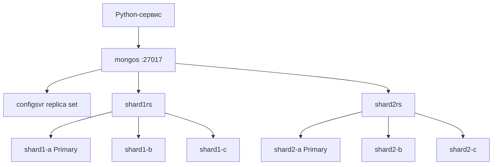

# MongoDB на практике: шардированный + реплицированный кластер и сервис на Python

Связанная заметка: [[MongoDB - Архитектура и CRUD]]

Цель: поднять локально минимальный, но полноценный кластер —
2 шарда (каждый — replica set из 3 узлов) + config server replica set (3 узла) + mongos-роутер,
и написать простой Python-сервис для работы с ним.



---

## 1. Docker Compose кластера

```yaml
# docker-compose.yml
version: "3.8"

services:
  # ---- Config server replica set (1 узел для простоты, в проде минимум 3) ----
  configsvr1:
    image: mongo:7.0
    command: mongod --configsvr --replSet configrs --port 27019 --bind_ip_all
    ports: ["27019:27019"]
    volumes: ["configsvr1_data:/data/db"]

  # ---- Shard 1 (replica set из 2 узлов + arbiter для простоты) ----
  shard1a:
    image: mongo:7.0
    command: mongod --shardsvr --replSet shard1rs --port 27018 --bind_ip_all
    ports: ["27021:27018"]
    volumes: ["shard1a_data:/data/db"]

  shard1b:
    image: mongo:7.0
    command: mongod --shardsvr --replSet shard1rs --port 27018 --bind_ip_all
    ports: ["27022:27018"]
    volumes: ["shard1b_data:/data/db"]

  # ---- Shard 2 (replica set из 2 узлов) ----
  shard2a:
    image: mongo:7.0
    command: mongod --shardsvr --replSet shard2rs --port 27018 --bind_ip_all
    ports: ["27031:27018"]
    volumes: ["shard2a_data:/data/db"]

  shard2b:
    image: mongo:7.0
    command: mongod --shardsvr --replSet shard2rs --port 27018 --bind_ip_all
    ports: ["27032:27018"]
    volumes: ["shard2b_data:/data/db"]

  # ---- mongos роутер ----
  mongos:
    image: mongo:7.0
    command: mongos --configdb configrs/configsvr1:27019 --bind_ip_all --port 27017
    ports: ["27017:27017"]
    depends_on: [configsvr1, shard1a, shard1b, shard2a, shard2b]

volumes:
  configsvr1_data:
  shard1a_data:
  shard1b_data:
  shard2a_data:
  shard2b_data:
```

> Для учебного стенда допустимо по 1–2 узла на replica set. В проде — 3+ голосующих узла на каждый набор, отдельные хосты/AZ, отдельный config server replica set минимум из 3 узлов.

Запуск:

```bash
docker compose up -d
```

---

## 2. Инициализация replica sets

### 2.1 Config server

```bash
docker exec -it <container_configsvr1> mongosh --port 27019
```

```js
rs.initiate({
  _id: "configrs",
  configsvr: true,
  members: [
    { _id: 0, host: "configsvr1:27019" }
  ]
})
```

### 2.2 Shard 1

```bash
docker exec -it <container_shard1a> mongosh --port 27018
```

```js
rs.initiate({
  _id: "shard1rs",
  members: [
    { _id: 0, host: "shard1a:27018" },
    { _id: 1, host: "shard1b:27018" }
  ]
})
```

### 2.3 Shard 2 — аналогично

```js
rs.initiate({
  _id: "shard2rs",
  members: [
    { _id: 0, host: "shard2a:27018" },
    { _id: 1, host: "shard2b:27018" }
  ]
})
```

---

## 3. Подключение шардов к роутеру и включение шардирования

```bash
docker exec -it <container_mongos> mongosh --port 27017
```

```js
sh.addShard("shard1rs/shard1a:27018,shard1b:27018")
sh.addShard("shard2rs/shard2a:27018,shard2b:27018")

// включаем шардирование для базы
sh.enableSharding("shopdb")

// выбираем shard key и включаем шардирование коллекции
// hashed - для равномерного распределения при монотонных ключах
db.orders.createIndex({ customerId: "hashed" })
sh.shardCollection("shopdb.orders", { customerId: "hashed" })

// проверка статуса
sh.status()
```

Проверка распределения чанков:

```js
use shopdb
db.orders.getShardDistribution()
```

---

## 4. Простой Python-сервис для взаимодействия

Используем `pymongo` + `FastAPI` — минимальный REST-сервис поверх шардированного кластера через `mongos`.

### 4.1 Зависимости

```bash
pip install pymongo fastapi uvicorn pydantic
```

### 4.2 Код сервиса

```python
# app.py
from fastapi import FastAPI, HTTPException
from pydantic import BaseModel
from pymongo import MongoClient, ASCENDING
from bson import ObjectId
from typing import Optional

# Подключаемся к mongos (не к отдельным шардам напрямую!)
MONGO_URI = "mongodb://localhost:27017/?readPreference=primaryPreferred"
client = MongoClient(MONGO_URI)
db = client["shopdb"]
orders = db["orders"]

app = FastAPI(title="Orders service over sharded MongoDB")


class OrderIn(BaseModel):
    customerId: str
    sku: str
    qty: int
    price: float


class OrderOut(OrderIn):
    id: str


def serialize(doc) -> OrderOut:
    return OrderOut(
        id=str(doc["_id"]),
        customerId=doc["customerId"],
        sku=doc["sku"],
        qty=doc["qty"],
        price=doc["price"],
    )


@app.on_event("startup")
def ensure_indexes():
    # индекс должен существовать до/во время шардирования коллекции
    orders.create_index([("customerId", ASCENDING)])


@app.post("/orders", response_model=OrderOut)
def create_order(order: OrderIn):
    result = orders.insert_one(order.model_dump())
    doc = orders.find_one({"_id": result.inserted_id})
    return serialize(doc)


@app.get("/orders/{order_id}", response_model=OrderOut)
def get_order(order_id: str):
    doc = orders.find_one({"_id": ObjectId(order_id)})
    if not doc:
        raise HTTPException(status_code=404, detail="Order not found")
    return serialize(doc)


@app.get("/customers/{customer_id}/orders", response_model=list[OrderOut])
def list_orders_by_customer(customer_id: str, limit: int = 20, skip: int = 0):
    cursor = orders.find({"customerId": customer_id}).skip(skip).limit(limit)
    return [serialize(d) for d in cursor]


@app.patch("/orders/{order_id}", response_model=OrderOut)
def update_order(order_id: str, qty: Optional[int] = None, price: Optional[float] = None):
    update_fields = {}
    if qty is not None:
        update_fields["qty"] = qty
    if price is not None:
        update_fields["price"] = price
    if not update_fields:
        raise HTTPException(status_code=400, detail="Nothing to update")

    result = orders.update_one({"_id": ObjectId(order_id)}, {"$set": update_fields})
    if result.matched_count == 0:
        raise HTTPException(status_code=404, detail="Order not found")

    doc = orders.find_one({"_id": ObjectId(order_id)})
    return serialize(doc)


@app.delete("/orders/{order_id}")
def delete_order(order_id: str):
    result = orders.delete_one({"_id": ObjectId(order_id)})
    if result.deleted_count == 0:
        raise HTTPException(status_code=404, detail="Order not found")
    return {"status": "deleted"}


@app.get("/stats/top-customers")
def top_customers(limit: int = 5):
    pipeline = [
        {"$group": {"_id": "$customerId", "total": {"$sum": {"$multiply": ["$qty", "$price"]}}}},
        {"$sort": {"total": -1}},
        {"$limit": limit},
    ]
    return list(orders.aggregate(pipeline))
```

### 4.3 Запуск

```bash
uvicorn app:app --reload --port 8000
```

### 4.4 Проверка

```bash
curl -X POST localhost:8000/orders \
  -H "Content-Type: application/json" \
  -d '{"customerId": "cust1", "sku": "A100", "qty": 2, "price": 19.99}'

curl localhost:8000/customers/cust1/orders
curl localhost:8000/stats/top-customers
```

---

## 5. Важные практические замечания

- **Приложение всегда подключается к `mongos`**, а не к отдельным shard-узлам напрямую — иначе теряется маршрутизация и целостность операций между шардами.
- **Shard key нельзя изменить** после шардирования коллекции (до MongoDB 5.0 — совсем нельзя, начиная с 5.0/6.0 доступен ограниченный `reshardCollection`). Выбор ключа — важное архитектурное решение "на берегу".
- Для отказоустойчивости при потере primary в любом replica set (config server или shard) кластер продолжает работать — mongos дождётся выбора нового primary; на это время возможны кратковременные ошибки записи.
- В `pymongo` можно явно управлять `read_preference` и `write_concern` на уровне клиента, базы, коллекции или отдельного запроса:

```python
from pymongo import ReadPreference
from pymongo.write_concern import WriteConcern

orders_majority = db.get_collection(
    "orders",
    write_concern=WriteConcern(w="majority"),
    read_preference=ReadPreference.SECONDARY_PREFERRED,
)
```

- Для локальной разработки без ручной инициации replica set можно использовать однонодовые dev-конфигурации через `mongo-init` скрипты, но для отработки реального поведения шардирования/репликации нужен именно многоузловой стенд, как выше.

---

## См. также
- [[MongoDB - Архитектура и CRUD]]
