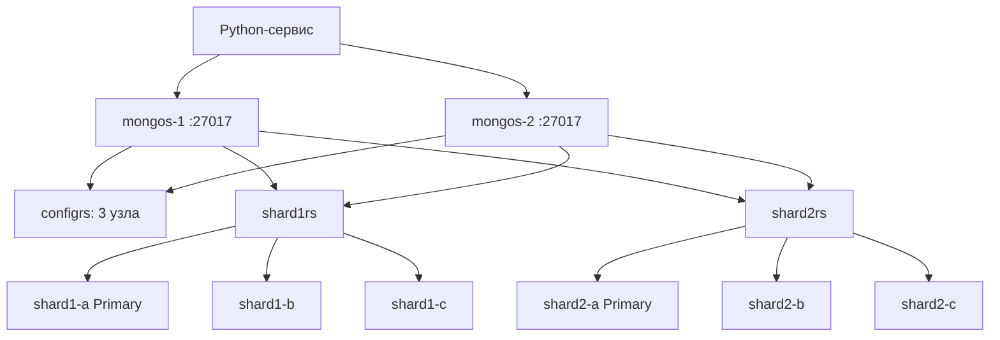

# MongoDB на практике: шардированный + реплицированный кластер и сервис на Python (production-grade)

Связанная заметка: [[MongoDB - Архитектура и CRUD]]

Цель: поднять локально кластер, максимально приближённый к продовому —
2 шарда (каждый — **replica set из 3 узлов**, без арбитров) + **config server replica set из 3 узлов** +
**2 mongos-роутера** (для отказоустойчивости роутинг-слоя) + внутренняя аутентификация через keyFile,
и написать простой Python-сервис для работы с ним.



---

## 1. Подготовка keyFile для внутренней аутентификации

Без этого шага кластер как бы «поднимется», но это будет учебная демонстрация без всякой защиты — в проде так делать нельзя: любой, кто может достучаться до портов mongod, получает полный доступ к данным.

```bash
mkdir -p secrets
openssl rand -base64 756 > secrets/mongo-keyfile
chmod 400 secrets/mongo-keyfile
# UID 999 — это пользователь mongodb внутри официального образа mongo:8.0
chown 999:999 secrets/mongo-keyfile
```

Создайте `.env` рядом с `docker-compose.yml` (не коммитить в git!):

```dotenv
# .env
MONGO_ROOT_USER=admin
MONGO_ROOT_PASSWORD=change-me-please
```

---

## 2. Docker Compose кластера

```yaml
# docker-compose.yml
# Обратите внимание: без "version:" — ключ устарел в Compose Specification,
# современный docker compose (v2) его больше не требует.

x-mongod-common: &mongod-common
  image: mongo:8
  restart: unless-stopped
  networks: [mongo-cluster]
  volumes:
    - ./secrets/mongo-keyfile:/etc/mongo-keyfile:ro
  healthcheck:
    test: ["CMD", "mongosh", "--quiet", "--eval", "db.adminCommand('ping').ok"]
    interval: 10s
    timeout: 5s
    retries: 5
    start_period: 20s

services:
  # ---- Config server replica set (3 узла — обязательный минимум для прода) ----
  configsvr1:
    <<: *mongod-common
    command: mongod --configsvr --replSet configrs --port 27019 --bind_ip_all --keyFile /etc/mongo-keyfile
    volumes:
      - ./secrets/mongo-keyfile:/etc/mongo-keyfile:ro
      - configsvr1_data:/data/db

  configsvr2:
    <<: *mongod-common
    command: mongod --configsvr --replSet configrs --port 27019 --bind_ip_all --keyFile /etc/mongo-keyfile
    volumes:
      - ./secrets/mongo-keyfile:/etc/mongo-keyfile:ro
      - configsvr2_data:/data/db

  configsvr3:
    <<: *mongod-common
    command: mongod --configsvr --replSet configrs --port 27019 --bind_ip_all --keyFile /etc/mongo-keyfile
    volumes:
      - ./secrets/mongo-keyfile:/etc/mongo-keyfile:ro
      - configsvr3_data:/data/db

  # ---- Shard 1 (replica set из 3 узлов, без арбитров) ----
  shard1a:
    <<: *mongod-common
    command: mongod --shardsvr --replSet shard1rs --port 27018 --bind_ip_all --keyFile /etc/mongo-keyfile
    volumes:
      - ./secrets/mongo-keyfile:/etc/mongo-keyfile:ro
      - shard1a_data:/data/db

  shard1b:
    <<: *mongod-common
    command: mongod --shardsvr --replSet shard1rs --port 27018 --bind_ip_all --keyFile /etc/mongo-keyfile
    volumes:
      - ./secrets/mongo-keyfile:/etc/mongo-keyfile:ro
      - shard1b_data:/data/db

  shard1c:
    <<: *mongod-common
    command: mongod --shardsvr --replSet shard1rs --port 27018 --bind_ip_all --keyFile /etc/mongo-keyfile
    volumes:
      - ./secrets/mongo-keyfile:/etc/mongo-keyfile:ro
      - shard1c_data:/data/db

  # ---- Shard 2 (replica set из 3 узлов) ----
  shard2a:
    <<: *mongod-common
    command: mongod --shardsvr --replSet shard2rs --port 27018 --bind_ip_all --keyFile /etc/mongo-keyfile
    volumes:
      - ./secrets/mongo-keyfile:/etc/mongo-keyfile:ro
      - shard2a_data:/data/db

  shard2b:
    <<: *mongod-common
    command: mongod --shardsvr --replSet shard2rs --port 27018 --bind_ip_all --keyFile /etc/mongo-keyfile
    volumes:
      - ./secrets/mongo-keyfile:/etc/mongo-keyfile:ro
      - shard2b_data:/data/db

  shard2c:
    <<: *mongod-common
    command: mongod --shardsvr --replSet shard2rs --port 27018 --bind_ip_all --keyFile /etc/mongo-keyfile
    volumes:
      - ./secrets/mongo-keyfile:/etc/mongo-keyfile:ro
      - shard2c_data:/data/db

  # ---- mongos-роутеры (2 шт. для отказоустойчивости уровня роутинга) ----
  mongos1:
    image: mongo:8
    restart: unless-stopped
    networks: [mongo-cluster]
    command: mongos --configdb configrs/configsvr1:27019,configsvr2:27019,configsvr3:27019 --bind_ip_all --port 27017 --keyFile /etc/mongo-keyfile
    volumes:
      - ./secrets/mongo-keyfile:/etc/mongo-keyfile:ro
    ports: ["27017:27017"]
    healthcheck:
      test: ["CMD", "mongosh", "--quiet", "--eval", "db.adminCommand('ping').ok"]
      interval: 10s
      timeout: 5s
      retries: 5
      start_period: 20s
    depends_on:
      configsvr1: { condition: service_healthy }
      configsvr2: { condition: service_healthy }
      configsvr3: { condition: service_healthy }
      shard1a: { condition: service_healthy }
      shard1b: { condition: service_healthy }
      shard1c: { condition: service_healthy }
      shard2a: { condition: service_healthy }
      shard2b: { condition: service_healthy }
      shard2c: { condition: service_healthy }

  mongos2:
    image: mongo:8
    restart: unless-stopped
    networks: [mongo-cluster]
    command: mongos --configdb configrs/configsvr1:27019,configsvr2:27019,configsvr3:27019 --bind_ip_all --port 27017 --keyFile /etc/mongo-keyfile
    volumes:
      - ./secrets/mongo-keyfile:/etc/mongo-keyfile:ro
    ports: ["27018:27017"]
    healthcheck:
      test: ["CMD", "mongosh", "--quiet", "--eval", "db.adminCommand('ping').ok"]
      interval: 10s
      timeout: 5s
      retries: 5
      start_period: 20s
    depends_on:
      mongos1: { condition: service_healthy }

networks:
  mongo-cluster:
    driver: bridge

volumes:
  configsvr1_data:
  configsvr2_data:
  configsvr3_data:
  shard1a_data:
  shard1b_data:
  shard1c_data:
  shard2a_data:
  shard2b_data:
  shard2c_data:
```

> В реальном проде узлы одного replica set обычно раскиданы по разным хостам/зонам доступности (AZ), а не
> живут как соседние контейнеры на одной машине — здесь это один docker-compose стенд исключительно для
> локальной отработки поведения кластера. Обратите внимание: **наружу (на хост) публикуются только порты
> mongos** (`27017`, `27018`) — шарды и config server доступны только внутри сети `mongo-cluster`, наружу их
> открывать в проде не нужно.

Запуск:

```bash
docker compose up -d
```

---

## 3. Инициализация replica sets

Все команды выполняются **до** появления первого пользователя — на этом этапе ещё активно
[localhost exception](https://www.mongodb.com/docs/manual/core/localhost-exception/): подключение с
localhost без пароля разрешено ровно до момента создания первого пользователя.

### 3.1 Config server

```bash
docker exec -it <container_configsvr1> mongosh --port 27019
```

```js
rs.initiate({
  _id: "configrs",
  configsvr: true,
  members: [
    { _id: 0, host: "configsvr1:27019" },
    { _id: 1, host: "configsvr2:27019" },
    { _id: 2, host: "configsvr3:27019" }
  ]
})
```

### 3.2 Shard 1

```bash
docker exec -it <container_shard1a> mongosh --port 27018
```

```js
rs.initiate({
  _id: "shard1rs",
  members: [
    { _id: 0, host: "shard1a:27018" },
    { _id: 1, host: "shard1b:27018" },
    { _id: 2, host: "shard1c:27018" }
  ]
})
```

### 3.3 Shard 2 — аналогично

```js
rs.initiate({
  _id: "shard2rs",
  members: [
    { _id: 0, host: "shard2a:27018" },
    { _id: 1, host: "shard2b:27018" },
    { _id: 2, host: "shard2c:27018" }
  ]
})
```

Проверить, что во всех трёх replica set выбрался primary (`rs.status()` → `stateStr: "PRIMARY"`) до
следующего шага.

---

## 4. Первый пользователь и подключение шардов к роутеру

```bash
docker exec -it <container_mongos1> mongosh --port 27017
```

Создаём root-пользователя (пока действует localhost exception):

```js
use admin
db.createUser({
  user: "admin",
  pwd: "change-me-please", // берите значение из .env, не хардкодьте в реальном проекте
  roles: [{ role: "root", db: "admin" }]
})
```

Дальше **все** команды в mongosh уже требуют аутентификации:

```bash
docker exec -it <container_mongos1> mongosh --port 27017 -u admin -p 'change-me-please' --authenticationDatabase admin
```

```js
sh.addShard("shard1rs/shard1a:27018,shard1b:27018,shard1c:27018")
sh.addShard("shard2rs/shard2a:27018,shard2b:27018,shard2c:27018")

// включаем шардирование для базы
sh.enableSharding("shopdb")

// выбираем shard key и включаем шардирование коллекции
// hashed - для равномерного распределения при монотонных ключах
db.orders.createIndex({ customerId: "hashed" })
sh.shardCollection("shopdb.orders", { customerId: "hashed" })

// отдельный прикладной пользователь с минимально необходимыми правами (не root!)
use shopdb
db.createUser({
  user: "app_user",
  pwd: "app-password",
  roles: [{ role: "readWrite", db: "shopdb" }]
})

// проверка статуса
sh.status()
```

Проверка распределения чанков:

```js
use shopdb
db.orders.getShardDistribution()
```

---

## 5. Простой Python-сервис для взаимодействия

Используем `pymongo` + `FastAPI` — минимальный REST-сервис поверх шардированного кластера через `mongos`.
Приложение подключается **к обоим mongos** и указывает БД для аутентификации.

### 5.1 Зависимости

```bash
pip install pymongo fastapi uvicorn pydantic
```

### 5.2 Код сервиса

```python
# app.py
import os
from contextlib import asynccontextmanager

from fastapi import FastAPI, HTTPException
from pydantic import BaseModel
from pymongo import MongoClient, ASCENDING
from bson import ObjectId
from bson.errors import InvalidId
from typing import Optional

# Подключаемся к mongos (не к отдельным shard-узлам напрямую!).
# Указаны оба роутера через запятую — если один недоступен, драйвер переключится на другой.
# Логин/пароль и БД аутентификации берём из окружения, а не хардкодим в коде.
MONGO_USER = os.environ["MONGO_APP_USER"]
MONGO_PASSWORD = os.environ["MONGO_APP_PASSWORD"]
MONGO_HOSTS = os.environ.get("MONGO_HOSTS", "mongos1:27017,mongos2:27017")

MONGO_URI = (
    f"mongodb://{MONGO_USER}:{MONGO_PASSWORD}@{MONGO_HOSTS}/"
    f"?authSource=shopdb&readPreference=primaryPreferred"
    f"&retryWrites=true&serverSelectionTimeoutMS=5000"
)

client = MongoClient(MONGO_URI)
db = client["shopdb"]
orders = db["orders"]


@asynccontextmanager
async def lifespan(app: FastAPI):
    # индекс должен существовать до/во время шардирования коллекции;
    # create_index идемпотентен, так что безопасно вызывать при каждом старте
    orders.create_index([("customerId", ASCENDING)])
    yield
    client.close()


app = FastAPI(title="Orders service over sharded MongoDB", lifespan=lifespan)


class OrderIn(BaseModel):
    customerId: str
    sku: str
    qty: int
    price: float


class OrderOut(OrderIn):
    id: str


def serialize(doc) -> OrderOut:
    return OrderOut(
        id=str(doc["_id"]),
        customerId=doc["customerId"],
        sku=doc["sku"],
        qty=doc["qty"],
        price=doc["price"],
    )


def parse_object_id(order_id: str) -> ObjectId:
    try:
        return ObjectId(order_id)
    except (InvalidId, TypeError):
        raise HTTPException(status_code=400, detail="Invalid order id format")


@app.post("/orders", response_model=OrderOut)
def create_order(order: OrderIn):
    result = orders.insert_one(order.model_dump())
    doc = orders.find_one({"_id": result.inserted_id})
    return serialize(doc)


@app.get("/orders/{order_id}", response_model=OrderOut)
def get_order(order_id: str):
    doc = orders.find_one({"_id": parse_object_id(order_id)})
    if not doc:
        raise HTTPException(status_code=404, detail="Order not found")
    return serialize(doc)


@app.get("/customers/{customer_id}/orders", response_model=list[OrderOut])
def list_orders_by_customer(customer_id: str, limit: int = 20, skip: int = 0):
    cursor = orders.find({"customerId": customer_id}).skip(skip).limit(limit)
    return [serialize(d) for d in cursor]


@app.patch("/orders/{order_id}", response_model=OrderOut)
def update_order(order_id: str, qty: Optional[int] = None, price: Optional[float] = None):
    update_fields = {}
    if qty is not None:
        update_fields["qty"] = qty
    if price is not None:
        update_fields["price"] = price
    if not update_fields:
        raise HTTPException(status_code=400, detail="Nothing to update")

    oid = parse_object_id(order_id)
    result = orders.update_one({"_id": oid}, {"$set": update_fields})
    if result.matched_count == 0:
        raise HTTPException(status_code=404, detail="Order not found")

    doc = orders.find_one({"_id": oid})
    return serialize(doc)


@app.delete("/orders/{order_id}")
def delete_order(order_id: str):
    oid = parse_object_id(order_id)
    result = orders.delete_one({"_id": oid})
    if result.deleted_count == 0:
        raise HTTPException(status_code=404, detail="Order not found")
    return {"status": "deleted"}


@app.get("/stats/top-customers")
def top_customers(limit: int = 5):
    pipeline = [
        {"$group": {"_id": "$customerId", "total": {"$sum": {"$multiply": ["$qty", "$price"]}}}},
        {"$sort": {"total": -1}},
        {"$limit": limit},
    ]
    return list(orders.aggregate(pipeline))
```

Что было исправлено в коде сервиса:
- `@app.on_event("startup")` — задепрекейчен в актуальных версиях FastAPI, заменён на `lifespan`.
- Конвертация `ObjectId(order_id)` без валидации кидала необработанное исключение (500) на невалидной
  строке — теперь это корректный `400 Bad Request` через `parse_object_id`.
- Логин/пароль и список хостов вынесены в переменные окружения — раньше строка подключения была захардкожена
  без аутентификации, что несовместимо с включённым `--keyFile`/`--auth`.
- В строке подключения указаны оба mongos через запятую — драйвер сам выберет доступный.

### 5.3 Запуск

```bash
export MONGO_APP_USER=app_user
export MONGO_APP_PASSWORD=app-password
uvicorn app:app --reload --port 8000
```

### 5.4 Проверка

```bash
curl -X POST localhost:8000/orders \
  -H "Content-Type: application/json" \
  -d '{"customerId": "cust1", "sku": "A100", "qty": 2, "price": 19.99}'

curl localhost:8000/customers/cust1/orders
curl localhost:8000/stats/top-customers
```

---

## 6. Важные практические замечания

- **Приложение всегда подключается к `mongos`**, а не к отдельным shard-узлам напрямую — иначе теряется
  маршрутизация и целостность операций между шардами.
- **Держите ≥ 2 экземпляра mongos.** Один mongos — единая точка отказа для всего кластера, даже если сами
  шарды и config server отказоустойчивы. Обычно mongos либо ставят рядом с каждым инстансом приложения, либо
  за балансировщиком.
- **Config server replica set — всегда 3+ узла в проде**, независимо от количества шардов: это не опция для
  экономии ресурсов, а точка отказа для метаданных всего кластера.
- **Предпочитайте data-bearing узлы арбитрам.** Арбитр не хранит данные и не может стать primary — при
  наличии ресурсов для полноценного третьего узла реплики он почти всегда предпочтительнее арбитра
  (полноценный голос + возможность обслуживать чтения/аварийный primary + участие в `w: "majority"`).
- **Shard key нельзя произвольно менять "на лету".** Начиная с MongoDB 5.0 доступна команда
  `reshardCollection`, которая позволяет сменить shard key целиком (пересобирая данные по новому ключу), а
  начиная с 4.4 — `refineCollectionShardKey`, которая позволяет **расширить** существующий shard key
  дополнительным полем (без полной пересборки), если новый ключ — это старый ключ плюс суффикс. Выбор
  первоначального ключа всё равно остаётся важным архитектурным решением "на берегу", т.к. `reshardCollection`
  — тяжёлая операция.
- Для отказоустойчивости при потере primary в любом replica set (config server или shard) кластер продолжает
  работать — mongos дождётся выбора нового primary; на это время возможны кратковременные ошибки записи.
- **Резервное копирование шардированного кластера — отдельная задача.** `mongodump` по каждому шарду отдельно
  не даёт согласованного снимка между шардами. Для консистентного бэкапа сharded-кластера нужны
  `$backupCursor`/`$backupCursorExtend` (на уровне каждого replica set с синхронизацией по времени) либо
  файловый снапшот (LVM/EBS/etc.) на каждом члене кластера, снятый в скоординированное время; на практике
  почти всегда используют MongoDB Ops Manager, Percona Backup for MongoDB или Atlas-бэкапы, а не ручной
  `mongodump`.
- В `pymongo` можно явно управлять `read_preference` и `write_concern` на уровне клиента, базы, коллекции
  или отдельного запроса:

```python
from pymongo import ReadPreference
from pymongo.write_concern import WriteConcern

orders_majority = db.get_collection(
    "orders",
    write_concern=WriteConcern(w="majority"),
    read_preference=ReadPreference.SECONDARY_PREFERRED,
)
```

- Внутренняя аутентификация через `--keyFile` в MongoDB **автоматически включает и авторизацию клиентов**
  (`--auth` отдельно указывать не обязательно, хотя это не вредит и повышает читаемость команды запуска).
- Для локальной разработки без ручной инициации replica set можно использовать однонодовые dev-конфигурации
  без auth, но для отработки реального поведения шардирования/репликации/безопасности нужен именно
  многоузловой стенд с keyFile, как выше.

---

## См. также
- [[MongoDB - Архитектура и CRUD]]
