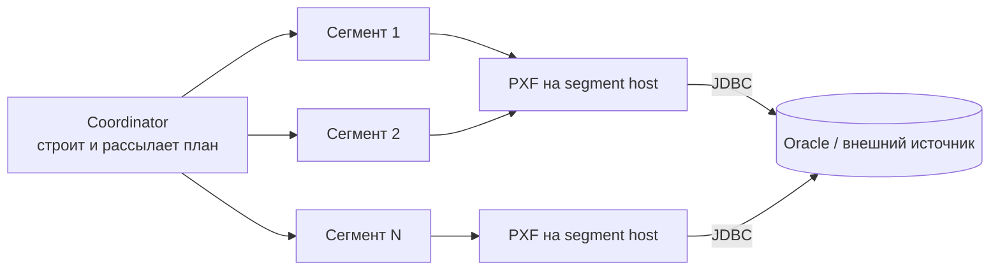
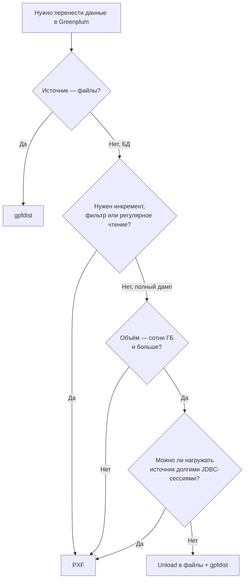

# PXF и gpfdist в Greenplum

> [!summary] Коротко
> 
> - **PXF** — Greenplum сам ходит во внешнюю систему (Oracle, PostgreSQL, MySQL, S3, HDFS) через коннектор.
> - **gpfdist** — параллельный файловый сервер: Greenplum забирает данные из файлов или отдаёт их в файлы через external tables.
> 
> **Прямой доступ к источнику → PXF. Быстрый массовый перенос через файлы → gpfdist.**

---

## 1. Сравнение

|Критерий|PXF|gpfdist|
|---|---|---|
|Что это|Framework-коннектор к внешним источникам|Файловый HTTP-демон для external tables|
|Источник данных|БД, S3, HDFS, Hive и др.|Только файлы (CSV, TXT и т. п.)|
|Промежуточная выгрузка|Не нужна|Нужна (источник → файлы)|
|Как читает|JDBC и др. коннекторы, фрагменты по сегментам|HTTP, сегменты тянут блоки напрямую|
|Pushdown фильтров|Да (filter pushdown, column projection)|Нет — читаются файлы целиком|
|Нагрузка на источник|Прямая, параллельные JDBC-сессии|Только на момент выгрузки файлов|
|Пик производительности|Ограничен источником и JDBC|Ограничен диском и сетью ETL-хостов|
|Типичный сценарий|Федеративные запросы, инкременты, выборки|Bulk load больших фактовых таблиц|

---

## 2. PXF

**PXF (Platform Extension Framework)** — слой доступа Greenplum к внешним данным. Источник отображается как external table, и Greenplum читает его без предварительной полной загрузки внутрь БД. Для SQL-источников используется **JDBC-коннектор** (Oracle, MySQL, PostgreSQL и др.); для Oracle отдельно поддерживается parallel query.

### Архитектура

PXF — не центральный прокси, через который идёт весь поток. Это распределённый сервис рядом с сегментами:

- фрагменты (fragments) внешнего набора данных распределяются между сегментами Greenplum;
- PXF-инстанс на каждом segment host обслуживает сегменты этого хоста (отдельный поток на сегмент);
- данные читаются параллельно, а не одним потоком.



### Параллелизм: `PARTITION_BY`

`PARTITION_BY` — это **подсказка PXF**, что внешний набор можно разбить на части и читать параллельно (каждая часть — отдельный поток PXF).

> [!warning] Это не про физическое партиционирование `PARTITION_BY` не связан ни с партициями таблицы в Oracle, ни с распределением данных в Greenplum.

> [!important] Без `PARTITION_BY` чтение идёт одним потоком Для JDBC без партиционирования весь запрос читается одной сессией, и параллелизм Greenplum не используется. Для больших таблиц `PARTITION_BY` практически обязателен.

Поддерживаются партиции по типам `int`, `date`, `enum`.

### Что умеет JDBC-коннектор

- **Column projection** — читаются только нужные колонки.
- **Filter pushdown** — `WHERE` отправляется в источник, лишнее не передаётся по сети.
- **Named queries** — внешняя таблица строится поверх произвольного SQL-запроса, лежащего в конфигурации сервера.
- **Partitioned reads** — параллельное чтение через `PARTITION_BY`.

### Пример

Конфигурация сервера (`$PXF_BASE/servers/oracle_prod/jdbc-site.xml`) задаёт драйвер, URL, логин и пароль. JDBC-драйвер Oracle кладётся в `$PXF_BASE/lib`; после изменений конфигурацию нужно синхронизировать на сегменты (`pxf cluster sync`) и перезапустить PXF.

```sql
CREATE EXTERNAL TABLE ext_orders (
    id      bigint,
    dt      date,
    amount  numeric
)
LOCATION ('pxf://SALES.ORDERS?PROFILE=Jdbc&SERVER=oracle_prod'
          '&PARTITION_BY=id:int&RANGE=1:100000000&INTERVAL=1000000')
FORMAT 'CUSTOM' (FORMATTER='pxfwritable_import');

INSERT INTO orders SELECT * FROM ext_orders WHERE dt >= '2026-01-01';
```

Здесь `RANGE` задаёт диапазон значений ключа, а `INTERVAL` — размер одной партиции (в примере получится 100 партиций).

### Ограничения

PXF упирается не только в Greenplum, но и в источник:

- число допустимых JDBC-соединений;
- производительность Oracle (в том числе parallel query);
- пропускная способность сети;
- качество ключа для `PARTITION_BY` (неравномерный ключ → перекос по потокам).

При плохом ключе или слабом источнике масштабирование будет хуже ожидаемого.

---

## 3. gpfdist

**gpfdist** — parallel file distribution program. Его используют readable external tables и `gpload`, чтобы раздавать файлы всем сегментам параллельно. Writable external tables используют его в обратную сторону: принимают параллельные потоки от сегментов и пишут их в файл.

> [!info] Важно gpfdist — **не коннектор к Oracle**. Он ничего не знает об источниках-БД и работает только с файлами.

### Архитектура

- запускается на хосте, который **не является coordinator или standby coordinator**;
- отдаёт файлы из указанного каталога сегментам;
- все сегменты читают или пишут параллельно.

**Чтение (readable external table):** gpfdist читает записи из файлов, упаковывает в блоки и отдаёт сегментам по запросу. Сегменты распаковывают строки и распределяют дальше по distribution policy целевой таблицы.

**Запись (writable external table):** сегменты отправляют блоки строк в gpfdist, он пишет их в файл.

### Где размещать

Не обязательно на сервере Oracle. Нужен хост, где лежат файлы и который доступен по сети **всем сегментам**. Обычно это ETL/staging-хост. Если файлы выгружаются на Oracle-сервер и он доступен сегментам, gpfdist можно поднять и там.

### Производительность

Документация называет gpfdist самым быстрым способом загрузки больших фактовых таблиц. Одна инстанция отдаёт порядка **200 МБ/с**, а инстанций можно запускать много — на разных хостах, дисках и сетевых интерфейсах.

### Пример

```bash
# на ETL-хосте
gpfdist -d /data/staging -p 8081 -l /var/log/gpfdist.log &
```

```sql
-- чтение
CREATE EXTERNAL TABLE ext_orders_file (LIKE orders)
LOCATION ('gpfdist://etl-host1:8081/orders_*.csv',
          'gpfdist://etl-host2:8081/orders_*.csv')
FORMAT 'CSV' (DELIMITER ',' HEADER)
LOG ERRORS SEGMENT REJECT LIMIT 100 ROWS;

INSERT INTO orders SELECT * FROM ext_orders_file;

-- запись (выгрузка из Greenplum в файлы)
CREATE WRITABLE EXTERNAL TABLE ext_orders_out (LIKE orders)
LOCATION ('gpfdist://etl-host1:8081/orders_out.csv')
FORMAT 'CSV'
DISTRIBUTED BY (id);
```

> [!tip] Практические советы
> 
> - Режь большой файл на несколько равных частей и раскладывай по разным gpfdist — так нет узкого места по диску и сети.
> - `LOG ERRORS SEGMENT REJECT LIMIT` позволяет не падать на единичных битых строках.
> - Для шифрования трафика есть `gpfdists` (HTTPS).
> - Для декларативной загрузки по YAML-конфигу есть утилита `gpload` — она поверх gpfdist.

---

## 4. Загрузка в таблицу `DISTRIBUTED BY (id)`

Ни PXF, ни gpfdist **не гарантируют**, что сегмент читает именно те строки, которые потом останутся у него по хэшу `id`.

### gpfdist

1. Coordinator парсит `INSERT INTO target SELECT * FROM ext_table`.
2. План отправляется на primary-сегменты.
3. Сегменты сами подключаются к gpfdist и читают данные параллельно.
4. Сегменты парсят строки и считают хэш по distribution key.
5. Строка пересылается на целевой сегмент.

Coordinator **не является data pump**, но и сегменты читают не «свои» строки: они берут любую часть потока, а потом отправляют строку по хэшу на нужный сегмент.

### PXF

PXF распределяет fragments между сегментами, а `PARTITION_BY` задаёт параллельное чтение отдельными потоками. Расположение данных в удалённой БД не учитывается.

> [!note] Вывод по PXF — логический В документации нет отдельной формулировки про Redistribute Motion для PXF. Это следствие архитектуры: PXF читает источник параллельно по фрагментам, поэтому Greenplum при необходимости перераспределяет строки по хэшу `id`.


> [!tip] Как проверить Посмотри `EXPLAIN INSERT INTO ... SELECT * FROM ext_table` — в плане будет узел **Redistribute Motion**.

---

## 5. Когда что использовать

### PXF, если

- нужен **прямой доступ** к Oracle или другой внешней системе;
- не хочется промежуточного staging в файлы;
- нужна только часть данных (фильтры, колонки, инкременты);
- нужен pushdown фильтров и projection;
- источник выдержит несколько параллельных JDBC-соединений.

Сценарий: `Oracle → PXF/JDBC → external table → INSERT … SELECT`

### gpfdist, если

- данные уже лежат в файлах;
- нужен **максимальный throughput** для bulk load;
- допустим двухшаговый pipeline (выгрузка → загрузка);
- можно разложить файлы по нескольким ETL-хостам, дискам и интерфейсам.

Сценарий: `Oracle → unload в CSV/TXT → gpfdist → external table → INSERT INTO target`

**Почему gpfdist быстрее на больших объёмах:**

- чтение идёт из файлов, а не через JDBC;
- сегменты читают параллельно и напрямую;
- можно запустить несколько gpfdist на разных хостах и интерфейсах;
- файлы можно заранее нарезать на равные куски.

---

## 6. Выбор для большой таблицы



- **Прямой путь без staging** → PXF. Проще интеграция, удобно для частичных выборок и инкрементов.
- **Максимальный throughput** → `Oracle unload → files → gpfdist → Greenplum`. Для больших фактовых таблиц обычно быстрее и стабильнее, чем гигантский объём через JDBC.

> [!tip] Чем выгружать из Oracle в файлы SQL*Plus (`SPOOL`), SQLcl (`SET SQLFORMAT CSV`), либо скрипт на Python с `python-oracledb`. Параллелить выгрузку можно по диапазонам ключа или ROWID.

---

## 7. Правила выбора

1. Источник — **Oracle / PostgreSQL / MySQL** и нужно читать напрямую → начинаю с **PXF**.
2. Объём очень большой (сотни ГБ — терабайты), цель — быстрый перенос → **выгрузка в файлы + gpfdist**.
3. Нужно снизить нагрузку на Oracle и избежать длинных JDBC-сессий → staged pipeline через файлы часто безопаснее (инженерный вывод: PXF читает источник напрямую, gpfdist работает с уже выгруженными файлами).
4. Целевая таблица `DISTRIBUTED BY (id)` → и PXF, и gpfdist читают не по «родному» хэшу Greenplum, поэтому возможно перераспределение строк между сегментами.

### Чек-лист перед запуском

- [ ] Для PXF: настроен сервер, драйвер в `lib`, конфигурация синхронизирована на сегменты
- [ ] Для PXF: выбран равномерный ключ `PARTITION_BY` и разумный `INTERVAL`
- [ ] Для gpfdist: хост доступен всем сегментам и не является coordinator / standby
- [ ] Для gpfdist: файлы разложены по нескольким инстансам / хостам
- [ ] Проверен `EXPLAIN` (Motion-узлы, число параллельных потоков)
- [ ] Согласована допустимая нагрузка на источник (число сессий, окно выгрузки)

---

## 8. Как запомнить

> **PXF** — Greenplum ходит во внешний источник через коннектор. **gpfdist** — Greenplum забирает или отдаёт данные через параллельный файловый сервер.

---

## Источники

- VMware Tanzu — [Platform Extension Framework (PXF): Enabling Parallel Query Processing Over Heterogeneous Data Sources In Greenplum](https://blogs.vmware.com/tanzu/platform-extension-framework-pxf-enabling-parallel-query-processing-over-heterogeneous-data-sources-in-greenplum/)
- VMware Tanzu — [Greenplum PXF for federated queries gets data quickly from diverse sources](https://blogs.vmware.com/tanzu/greenplum-pxf-for-federated-queries-gets-data-quickly-from-diverse-sources/)
- Apache Cloudberry — [Load Data Using gpfdist](https://cloudberry.apache.org/docs/data-loading/load-data-using-gpfdist)
- Apache Cloudberry — [gpfdist (утилита)](https://cloudberry.apache.org/docs/sys-utilities/gpfdist/)
- Apache Cloudberry — [Load Data Best Practices](https://cloudberry.apache.org/docs/next/tutorials/best-practices/load-data-best-practices)

> [!info] О Cloudberry Apache Cloudberry — родственный Greenplum проект. Механика gpfdist и external tables в нём совпадает с Greenplum, поэтому его документация подходит как справочник.