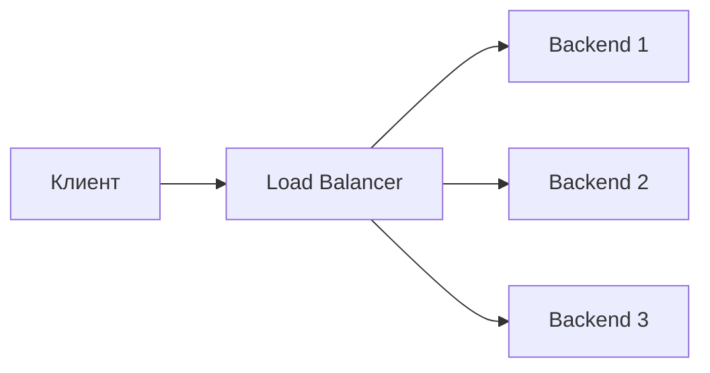
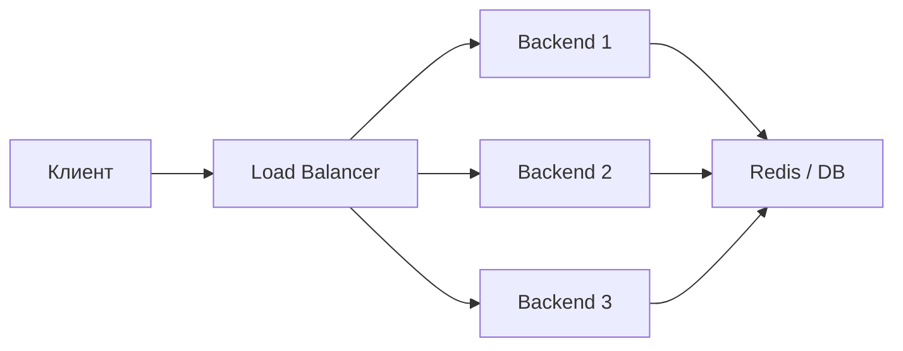
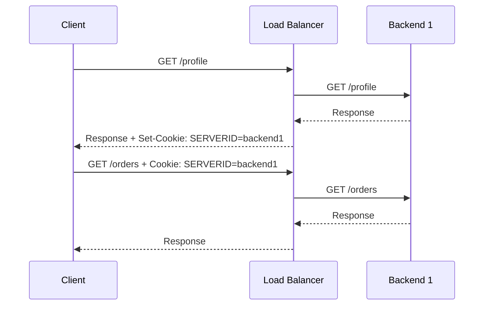
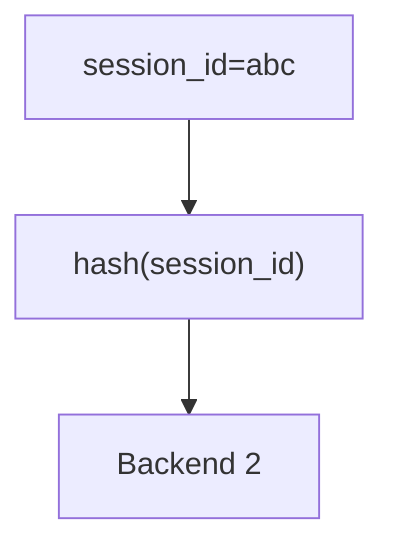
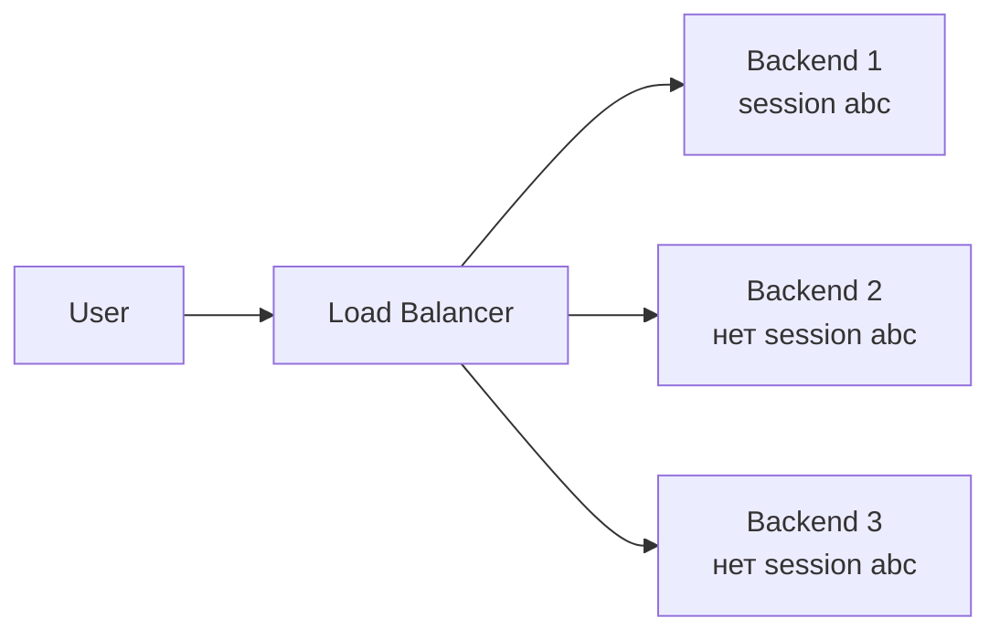
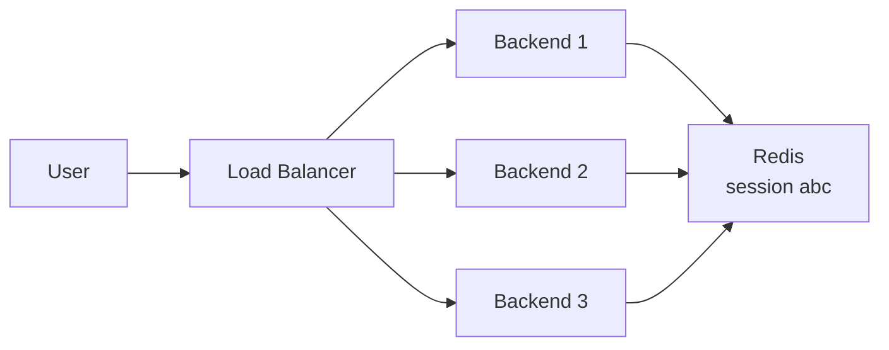

**Sticky session** — это механизм, при котором балансировщик нагрузки старается отправлять повторные запросы одного и того же клиента на один и тот же backend-сервер.

Другие названия:

- **session affinity**;
- **session persistence**;
- **sticky cookie**;
- **affinity routing**.

Простая идея:

```text
Пользователь A → Load Balancer → Backend 1
Пользователь A → Load Balancer → Backend 1
Пользователь A → Load Balancer → Backend 1
```

А не так:

```text
Пользователь A → Backend 1
Пользователь A → Backend 2
Пользователь A → Backend 3
```

Sticky sessions нужны, когда приложение хранит состояние пользователя **локально на конкретном сервере**.

---

# 1. Проблема без sticky sessions

Представим, что есть 3 backend-сервера:



Клиент авторизовался, а его сессия сохранилась только на `Backend 1`.

```text
Backend 1:
session_id=abc123 → user_id=42

Backend 2:
нет такой сессии

Backend 3:
нет такой сессии
```

Если следующий запрос попадёт на `Backend 2`, приложение может не найти сессию.

Результат:

- пользователя может разлогинить;
- корзина может пропасть;
- состояние формы может потеряться;
- websocket-подключение может работать нестабильно;
- приложение может вести себя непредсказуемо.

Sticky session решает это так:

```text
если пользователь уже попал на Backend 1,
следующие запросы этого пользователя тоже отправлять на Backend 1
```

---

# 2. Где обычно применяется sticky session

Sticky sessions встречаются в системах, где сервер хранит пользовательское состояние у себя.

Примеры:

- авторизация через server-side session;
- корзина интернет-магазина в памяти приложения;
- wizard-форма из нескольких шагов;
- старые monolith-приложения;
- websocket-соединения;
- игровые серверы;
- админки;
- legacy-приложения;
- приложения без Redis/Memcached для сессий.

---

# 3. Stateful и stateless приложения

## Stateful-приложение

**Stateful** означает, что сервер хранит состояние клиента у себя.

Например:

```text
Backend 1 хранит:
session_id → user_data
```

Проблема: если клиент попадёт на другой backend, этот другой backend может не знать о его сессии.

Sticky sessions часто нужны именно для stateful-приложений.

## Stateless-приложение

**Stateless** означает, что сервер не хранит состояние конкретного клиента локально.

Примеры:

- JWT-токен хранится у клиента;
- сессии лежат в Redis;
- состояние хранится в базе данных;
- любой backend может обработать любой запрос.

В stateless-архитектуре sticky sessions обычно не нужны.



Если все backend-серверы ходят в общий Redis или базу за сессией, то клиент может попадать на любой backend.

---

# 4. Как работает sticky session

Балансировщик должен каким-то образом понять, что запросы принадлежат одному и тому же клиенту.

Для этого используют разные признаки.

Основные варианты:

| Способ | Идея |
|---|---|
| Cookie-based affinity | балансировщик ставит cookie и по ней узнаёт клиента |
| IP-based affinity | клиент определяется по IP-адресу |
| Header-based affinity | клиент определяется по HTTP-заголовку |
| URL/path-based routing | маршрутизация по пути, но это не классическая sticky session |
| Consistent hashing | backend выбирается через хеш от IP, cookie, header или другого ключа |

---

# 5. Cookie-based sticky session

Это самый популярный и обычно самый нормальный вариант для HTTP.

## Как работает

1. Клиент делает первый запрос.
2. Load Balancer выбирает backend.
3. Load Balancer добавляет клиенту cookie.
4. В следующих запросах клиент отправляет эту cookie.
5. Load Balancer по cookie понимает, на какой backend отправлять клиента.



## Пример cookie

```http
Set-Cookie: SERVERID=backend1; Path=/; HttpOnly; Secure; SameSite=Lax
```

В следующих запросах клиент отправляет:

```http
Cookie: SERVERID=backend1
```

## Плюсы

- точнее, чем IP-based;
- хорошо работает за NAT;
- подходит для браузерных приложений;
- можно контролировать время жизни affinity;
- можно сделать cookie безопасной.

## Минусы

- работает только там, где клиент поддерживает cookie;
- нужно аккуратно настраивать безопасность cookie;
- при падении backend-сервера cookie может указывать на недоступный backend;
- может мешать равномерному распределению нагрузки.

---

# 6. IP-based sticky session

При IP-based affinity балансировщик привязывает клиента к backend-серверу по IP-адресу.

Пример:

```text
hash(192.168.1.25) → Backend 2
```

## Плюсы

- просто;
- не нужны cookie;
- работает не только для HTTP;
- может применяться на L4-балансировке.

## Минусы

- плохо работает, если много пользователей сидят за одним NAT;
- мобильные клиенты могут менять IP;
- корпоративные прокси могут скрывать реальных пользователей;
- нагрузка может распределяться неровно.

Плохой сценарий:

```text
1000 пользователей из одного офиса → один внешний IP → один backend
```

В результате один backend перегружен, остальные простаивают.

---

# 7. Header-based sticky session

Иногда backend выбирается по HTTP-заголовку.

Например:

```http
X-User-ID: 42
```

или:

```http
Authorization: Bearer ...
```

Идея:

```text
hash(header_value) → backend
```

Такой подход может быть удобен в микросервисах, API Gateway или service mesh.

## Плюсы

- можно привязывать не к IP, а к пользователю;
- подходит для API;
- можно использовать tenant id, user id, organization id.

## Минусы

- нужно доверять источнику заголовка;
- нельзя принимать важные routing-заголовки напрямую от клиента без проверки;
- сложнее настраивать;
- не всегда поддерживается стандартными балансировщиками.

---

# 8. Sticky session через consistent hashing

**Consistent hashing** — способ распределения запросов, при котором backend выбирается по хешу ключа.

Ключом может быть:

- IP клиента;
- cookie;
- user id;
- session id;
- tenant id;
- header.

Пример:

```text
hash(session_id) → Backend N
```

Плюс consistent hashing в том, что при добавлении или удалении backend-сервера не все клиенты резко переезжают на новые серверы.

Упрощённая схема:



---

# 9. Sticky session и load balancing algorithms

Sticky sessions работают поверх или рядом с алгоритмами балансировки.

Обычные алгоритмы:

| Алгоритм | Что делает |
|---|---|
| Round Robin | по очереди отправляет запросы на backend-серверы |
| Least Connections | выбирает сервер с наименьшим числом соединений |
| Weighted Round Robin | распределяет по весам |
| Random | выбирает случайный backend |
| Hash-based | выбирает backend по хешу ключа |

Без sticky session:

```text
Request 1 → Backend 1
Request 2 → Backend 2
Request 3 → Backend 3
```

Со sticky session:

```text
Первый запрос → выбираем backend обычным алгоритмом
Следующие запросы → отправляем на тот же backend по cookie/IP/header
```

---

# 10. Пример NGINX

## Вариант через `ip_hash`

Простейшая sticky session по IP:

```nginx
upstream app_backend {
    ip_hash;

    server 10.0.0.11:8000;
    server 10.0.0.12:8000;
    server 10.0.0.13:8000;
}

server {
    listen 80;

    location / {
        proxy_pass http://app_backend;
    }
}
```

Что происходит:

```text
один и тот же IP клиента → один и тот же backend
```

Минусы те же: NAT, мобильные сети, корпоративные прокси.

## Вариант через hash

Можно выбрать backend по произвольному ключу:

```nginx
upstream app_backend {
    hash $cookie_SESSIONID consistent;

    server 10.0.0.11:8000;
    server 10.0.0.12:8000;
    server 10.0.0.13:8000;
}

server {
    listen 80;

    location / {
        proxy_pass http://app_backend;
    }
}
```

Здесь backend выбирается по cookie `SESSIONID`.

---

# 11. Пример HAProxy

HAProxy часто используют для sticky sessions через cookie.

```haproxy
backend app_backend
    balance roundrobin

    cookie SERVERID insert indirect nocache

    server app1 10.0.0.11:8000 check cookie app1
    server app2 10.0.0.12:8000 check cookie app2
    server app3 10.0.0.13:8000 check cookie app3
```

Что значит:

| Строка | Значение |
|---|---|
| `balance roundrobin` | первый выбор backend-сервера идёт по round robin |
| `cookie SERVERID insert` | HAProxy добавляет cookie `SERVERID` |
| `server app1 ... cookie app1` | если cookie указывает `app1`, запрос идёт на app1 |
| `check` | HAProxy проверяет здоровье backend-сервера |

Пример ответа клиенту:

```http
Set-Cookie: SERVERID=app1
```

Следующий запрос:

```http
Cookie: SERVERID=app1
```

HAProxy снова отправит клиента на `app1`.

---

# 12. Пример Kubernetes Service sessionAffinity

В Kubernetes у `Service` есть настройка `sessionAffinity`.

Пример:

```yaml
apiVersion: v1
kind: Service
metadata:
  name: app-service
spec:
  selector:
    app: my-app
  ports:
    - port: 80
      targetPort: 8080
  sessionAffinity: ClientIP
  sessionAffinityConfig:
    clientIP:
      timeoutSeconds: 10800
```

Что это значит:

```text
запросы с одного ClientIP будут стараться попадать на один и тот же Pod
```

Важное ограничение: это привязка по IP, а не по cookie.

## Когда это может быть плохо

Если много пользователей приходят через один NAT или один ingress, Kubernetes может видеть один и тот же IP.

Тогда много клиентов могут попасть на один Pod.

---

# 13. Пример NGINX Ingress в Kubernetes

В NGINX Ingress можно использовать cookie affinity через аннотации.

Пример:

```yaml
apiVersion: networking.k8s.io/v1
kind: Ingress
metadata:
  name: app-ingress
  annotations:
    nginx.ingress.kubernetes.io/affinity: "cookie"
    nginx.ingress.kubernetes.io/session-cookie-name: "route"
    nginx.ingress.kubernetes.io/session-cookie-max-age: "172800"
spec:
  rules:
    - host: app.example.com
      http:
        paths:
          - path: /
            pathType: Prefix
            backend:
              service:
                name: app-service
                port:
                  number: 80
```

Что происходит:

- Ingress ставит cookie;
- следующие запросы с этой cookie идут на тот же upstream endpoint;
- это лучше, чем `ClientIP`, если клиенты сидят за NAT.

---

# 14. Пример AWS ALB stickiness

В AWS Application Load Balancer можно включить stickiness на уровне target group.

Обычно используются cookies:

- duration-based stickiness;
- application-based stickiness.

Общая идея:

```text
ALB ставит cookie → клиент возвращается на тот же target
```

Типичные cookie ALB:

```text
AWSALB
AWSALBCORS
```

Важно: конкретные настройки зависят от типа target group и режима stickiness.

---

# 15. Sticky session и WebSocket

Для WebSocket sticky sessions часто важны.

Почему:

- WebSocket — это долгоживущее соединение;
- состояние соединения часто находится в памяти конкретного backend;
- если соединение оборвалось и клиент переподключился, желательно отправить его на тот же сервер;
- если серверы не обмениваются состоянием, другой backend может не знать контекст.

Но есть нюанс:

```text
пока WebSocket-соединение открыто, оно уже физически привязано к одному backend
```

Sticky session особенно важна для повторных подключений и связанных HTTP-запросов.

---

# 16. Sticky session и Redis

Sticky sessions часто используют, когда сессии лежат в памяти backend-сервера.

Но более масштабируемый вариант — вынести сессии в Redis.

## Без Redis



Нужна sticky session.

## С Redis



Sticky session обычно уже не нужна, потому что любой backend может прочитать сессию из Redis.

---

# 17. Плюсы sticky sessions

## 1. Простота

Можно быстро решить проблему локальных сессий без переработки приложения.

## 2. Удобно для legacy

Если старое приложение хранит сессии в памяти, sticky sessions позволяют масштабировать его горизонтально хотя бы частично.

## 3. Меньше обращений к внешнему хранилищу

Если состояние хранится локально, не нужно каждый раз ходить в Redis или базу.

## 4. Полезно для долгих соединений

Например:

- WebSocket;
- long polling;
- игровые соединения;
- интерактивные приложения.

---

# 18. Минусы sticky sessions

## 1. Неравномерная нагрузка

Если часть клиентов очень активная, их backend может быть перегружен.

```text
Backend 1: 1000 активных пользователей
Backend 2: 200 обычных пользователей
Backend 3: 150 обычных пользователей
```

Даже если всего серверов три, нагрузка будет распределена плохо.

## 2. Плохая отказоустойчивость

Если backend упал, пользователи, привязанные к нему, потеряют локальное состояние.

```text
Backend 1 упал → все его sticky-пользователи страдают
```

## 3. Сложнее autoscaling

При добавлении нового backend-сервера старые пользователи остаются на старых серверах.  
Новый сервер может получать только новых пользователей.

## 4. Vendor lock-in

Механизм sticky sessions зависит от конкретного балансировщика:

- NGINX;
- HAProxy;
- AWS ALB;
- Kubernetes Ingress;
- Traefik;
- Envoy.

Настройки могут сильно отличаться.

## 5. Маскирует архитектурную проблему

Часто sticky sessions — это временный костыль вместо нормальной stateless-архитектуры.

---

# 19. Что происходит при падении backend

Допустим, клиент привязан к `Backend 1`.

```text
Cookie: SERVERID=backend1
```

Если `Backend 1` упал, балансировщик должен выбрать другой backend.

Возможные последствия:

- пользователь потеряет сессию;
- корзина пропадёт;
- websocket оборвётся;
- форма сбросится;
- потребуется повторный логин.

Если сессии лежат в Redis или БД, последствия меньше:

```text
Backend 1 упал → запрос ушёл на Backend 2 → Backend 2 прочитал сессию из Redis
```

---

# 20. Sticky session и безопасность

## Cookie должна быть защищена

Если используется cookie-based sticky session, cookie желательно настраивать с флагами:

```http
Set-Cookie: SERVERID=app1; Path=/; HttpOnly; Secure; SameSite=Lax
```

| Флаг | Зачем нужен |
|---|---|
| `HttpOnly` | JavaScript не сможет прочитать cookie |
| `Secure` | cookie отправляется только по HTTPS |
| `SameSite` | снижает риск CSRF-сценариев |
| `Path` | ограничивает область действия cookie |

## Не хранить секреты в sticky cookie

Плохая идея:

```http
Set-Cookie: SERVERID=user_id_42_admin_true
```

В sticky cookie не должно быть чувствительных данных.

Нормальнее:

```http
Set-Cookie: SERVERID=app1
```

или случайный opaque-id:

```http
Set-Cookie: ROUTEID=82a1f3c9
```

## Не доверять клиентским routing-заголовкам

Если маршрутизация идёт по заголовку, который клиент может сам подставить, это опасно.

Например:

```http
X-Backend: admin-node
```

Такой заголовок нельзя просто принимать от внешнего клиента и использовать для маршрутизации без проверки.

---

# 21. Типичные ошибки

## Ошибка 1. Использовать sticky sessions вместо нормального хранения сессий

Sticky sessions могут помочь, но часто лучше вынести сессии в Redis.

Плохой вариант:

```text
сессии в памяти backend + sticky forever
```

Лучше:

```text
сессии в Redis + любой backend может обработать запрос
```

## Ошибка 2. Использовать IP affinity для публичного сайта

Из-за NAT и мобильных сетей это может привести к плохому распределению нагрузки.

## Ошибка 3. Не настроить health checks

Если backend умер, балансировщик должен перестать слать туда запросы.

## Ошибка 4. Делать слишком длинный TTL sticky cookie

Если cookie живёт слишком долго, пользователи слишком долго остаются привязанными к старым backend-серверам.

## Ошибка 5. Не учитывать autoscaling

При autoscaling новые backend-серверы могут получать мало трафика, если старые sticky-сессии остаются на старых серверах.

---

# 22. Когда sticky sessions нужны

Sticky sessions можно использовать, если:

- приложение legacy;
- сессии хранятся в памяти backend;
- быстро нужно масштабировать приложение без переписывания;
- есть WebSocket или long polling;
- состояние клиента дорого переносить между серверами;
- приложение пока не готово к stateless-архитектуре.

---

# 23. Когда sticky sessions лучше не использовать

Лучше избегать sticky sessions, если:

- можно сделать приложение stateless;
- сессии можно хранить в Redis;
- нужен хороший autoscaling;
- нужна высокая отказоустойчивость;
- нагрузка клиентов сильно неравномерная;
- сервис должен легко переносить падение backend-серверов.

---

# 24. Лучший практический подход

## Для современного backend

Лучше стремиться к stateless:

```text
JWT / Redis / DB / shared storage
```

Тогда:

```text
любой backend может обработать любой запрос
```

## Для legacy backend

Можно временно использовать sticky sessions:

```text
cookie-based affinity на балансировщике
```

Но лучше держать в голове план миграции:

```text
локальные сессии → Redis/session storage → stateless backend
```

---

# 25. Сравнение подходов

| Подход | Плюсы | Минусы |
|---|---|---|
| Cookie-based sticky | точнее IP, хорошо для HTTP | зависит от cookie |
| IP-based sticky | просто, работает на L4 | плохо с NAT и мобильными сетями |
| Header-based sticky | удобно для API и tenants | нужно доверять заголовкам |
| Redis session store | любой backend может обработать запрос | нужен внешний сервис |
| JWT | stateless, удобно масштабировать | сложнее отзывать токены |
| Local memory sessions | быстро и просто | плохо масштабируется |

---

# 26. Мини-шпаргалка

## Sticky session

```text
один клиент → один backend
```

## Stateless backend

```text
любой клиент → любой backend
```

## Самый частый вариант sticky session

```text
Load Balancer ставит cookie SERVERID
```

## Главная проблема sticky session

```text
плохая отказоустойчивость и неравномерная нагрузка
```

## Более правильная архитектура

```text
сессии в Redis или JWT → backend не зависит от конкретного сервера
```

---

# 27. Простой пример сценария

Есть интернет-магазин:

```text
Backend 1
Backend 2
Backend 3
```

Пользователь добавил товар в корзину.

Если корзина хранится в памяти backend:

```text
Пользователь попал на Backend 1
Корзина лежит только на Backend 1
```

Нужна sticky session, чтобы следующие запросы шли на `Backend 1`.

Если корзина хранится в Redis:

```text
Корзина лежит в Redis
Backend 1, Backend 2, Backend 3 могут её прочитать
```

Sticky session не нужна.

---

# 28. Вопросы для собеседования

## Что такое sticky session?

Механизм, при котором балансировщик старается направлять запросы одного клиента на один и тот же backend-сервер.

## Зачем нужны sticky sessions?

Чтобы приложение, которое хранит состояние пользователя локально на backend-сервере, не теряло это состояние между запросами.

## Какие есть способы sticky sessions?

- cookie-based;
- IP-based;
- header-based;
- hash-based.

## Почему sticky sessions могут быть плохой идеей?

Потому что они ухудшают балансировку нагрузки, усложняют отказоустойчивость и могут мешать autoscaling.

## Чем заменить sticky sessions?

- хранить сессии в Redis;
- использовать JWT;
- делать backend stateless;
- хранить состояние в общей БД или shared storage.

---

# 29. Ключевая мысль

Sticky session — это не “плохой” и не “хороший” механизм сам по себе.

Это компромисс.

Он полезен, когда приложение хранит состояние локально и его нужно быстро масштабировать через балансировщик.

Но для современной архитектуры лучше стремиться к тому, чтобы backend был stateless, а состояние пользователя хранилось во внешнем общем хранилище.

Тогда приложение легче масштабировать, обновлять и восстанавливать после падений.

---

# 30. Источники и куда смотреть дальше

- NGINX documentation: upstream load balancing, `ip_hash`, `hash`.
- HAProxy documentation: cookies and persistence.
- Kubernetes documentation: Service `sessionAffinity`.
- NGINX Ingress Controller documentation: sticky sessions / cookie affinity.
- AWS Elastic Load Balancing documentation: target group stickiness.
- Envoy documentation: stateful session filter, ring hash load balancing.
