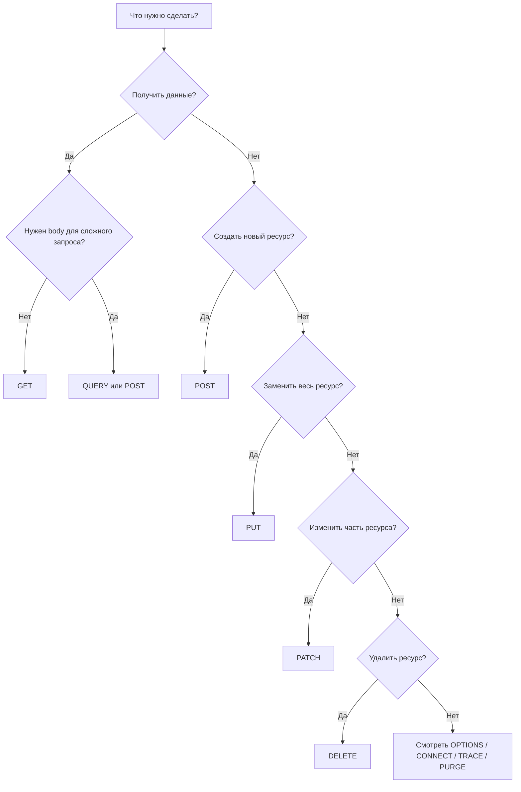

# HTTP методы запросов

HTTP-метод показывает, **какое действие клиент хочет выполнить с ресурсом на сервере**.

Пример:

```http
GET /api/telegram HTTP/1.1
Host: example.com
```

Здесь:

- `GET` — метод;
- `/api/telegram` — путь к ресурсу;
- `HTTP/1.1` — версия протокола.

---

# Базовые понятия

## Safe method

**Safe** — безопасный метод. Он не должен изменять состояние сервера.

Например, `GET` должен только получать данные, а не создавать, удалять или изменять их.

Важно: сервер всё равно может писать логи, считать статистику и обновлять технические метрики. Это не считается изменением бизнес-состояния ресурса.

## Idempotent method

**Idempotent** — идемпотентный метод. Это значит, что повторный одинаковый запрос должен приводить к тому же результату состояния ресурса.

Пример:

```http
DELETE /users/10
```

Если удалить пользователя один раз, он удалится. Если отправить тот же запрос ещё раз, состояние системы не изменится: пользователя уже нет.

## Cacheable method

**Cacheable** — ответ на запрос можно кэшировать при соблюдении правил HTTP-кэширования.

Чаще всего кэшируют ответы на `GET` и `HEAD`. Иногда могут кэшироваться и другие методы, если это явно разрешено заголовками, но на практике это встречается реже.

---

# Краткая таблица методов

| Метод | Основная идея | Safe | Idempotent | Часто используется в REST |
|---|---|---:|---:|---:|
| `GET` | Получить ресурс | Да | Да | Да |
| `HEAD` | Получить только заголовки, без тела ответа | Да | Да | Иногда |
| `POST` | Создать ресурс или выполнить действие | Нет | Нет | Да |
| `PUT` | Полностью заменить ресурс | Нет | Да | Да |
| `PATCH` | Частично изменить ресурс | Нет | Не гарантируется | Да |
| `DELETE` | Удалить ресурс | Нет | Да | Да |
| `OPTIONS` | Узнать доступные методы и возможности сервера | Да | Да | Иногда |
| `TRACE` | Диагностика, вернуть запрос обратно клиенту | Да | Да | Почти не используется |
| `CONNECT` | Создать туннель, чаще для HTTPS через proxy | Нет | Нет | Редко напрямую |
| `PURGE` | Очистить кэш ресурса | Нет | Зависит от реализации | Не стандартный REST |
| `QUERY` | Безопасный запрос с телом, похож на GET с body | Да | Да | Новый метод, пока редкий |

---

# GET

`GET` используется для получения данных.

Примеры задач:

- получить список пользователей;
- получить один товар;
- открыть страницу;
- получить данные профиля.

Пример:

```http
GET /users
GET /users/15
GET /products?category=laptop
```

Особенности:

- не должен менять данные на сервере;
- параметры часто передаются в URL;
- обычно может кэшироваться;
- тело запроса обычно не используют.

Пример в REST:

```http
GET /api/users/15
```

Смысл: получить пользователя с id `15`.

---

# HEAD

`HEAD` похож на `GET`, но сервер возвращает **только заголовки**, без тела ответа.

Пример:

```http
HEAD /files/report.pdf
```

Зачем нужен:

- проверить, существует ли ресурс;
- узнать размер файла;
- проверить дату изменения;
- проверить тип контента;
- не скачивать весь файл целиком.

Пример ответа:

```http
HTTP/1.1 200 OK
Content-Type: application/pdf
Content-Length: 245000
Last-Modified: Tue, 10 Jun 2026 12:00:00 GMT
```

---

# POST

`POST` чаще всего используется для создания нового ресурса или запуска действия на сервере.

Примеры задач:

- создать пользователя;
- отправить форму;
- оформить заказ;
- запустить оплату;
- отправить сообщение.

Пример:

```http
POST /api/users
Content-Type: application/json

{
  "name": "Ivan",
  "email": "ivan@example.com"
}
```

Особенности:

- обычно меняет состояние сервера;
- не является idempotent;
- повторный `POST` может создать два одинаковых ресурса;
- данные обычно передаются в теле запроса.

Пример проблемы:

```http
POST /api/orders
```

Если отправить запрос два раза, можно создать два заказа.

---

# PUT

`PUT` используется для **полной замены ресурса**.

Пример:

```http
PUT /api/users/15
Content-Type: application/json

{
  "name": "Ivan Petrov",
  "email": "ivan.petrov@example.com"
}
```

Смысл: полностью заменить данные пользователя `15` на переданные данные.

Особенности:

- idempotent;
- если отправить один и тот же `PUT` несколько раз, итоговое состояние ресурса будет одинаковым;
- обычно требует передавать полное состояние ресурса.

Важно отличать от `PATCH`:

- `PUT` — заменить весь объект;
- `PATCH` — изменить часть объекта.

---

# PATCH

`PATCH` используется для **частичного изменения ресурса**.

Пример:

```http
PATCH /api/users/15
Content-Type: application/json

{
  "email": "new-email@example.com"
}
```

Смысл: изменить только email пользователя `15`, не трогая остальные поля.

Особенности:

- удобен для частичных обновлений;
- не обязан быть idempotent;
- поведение зависит от того, как сервер применяет изменения.

Пример idempotent `PATCH`:

```json
{
  "email": "new-email@example.com"
}
```

Если отправить несколько раз, email останется тем же.

Пример потенциально не idempotent `PATCH`:

```json
{
  "operation": "increase_balance",
  "amount": 100
}
```

Если отправить несколько раз, баланс увеличится несколько раз.

---

# DELETE

`DELETE` используется для удаления ресурса.

Пример:

```http
DELETE /api/users/15
```

Смысл: удалить пользователя с id `15`.

Особенности:

- меняет состояние сервера;
- idempotent;
- повторный `DELETE` не должен повторно менять состояние;
- второй запрос может вернуть `404 Not Found` или `204 No Content`, это зависит от реализации API.

Пример:

```http
DELETE /api/files/100
```

После первого запроса файл удалён. Повторный запрос не удалит его ещё раз, потому что файла уже нет.

---

# OPTIONS

`OPTIONS` используется, чтобы узнать, какие методы и возможности доступны для ресурса.

Пример:

```http
OPTIONS /api/users
```

Пример ответа:

```http
HTTP/1.1 204 No Content
Allow: GET, POST, OPTIONS
```

Частый случай использования — CORS preflight-запросы в браузере.

Например, перед сложным запросом браузер может сначала отправить `OPTIONS`, чтобы узнать, разрешает ли сервер такой запрос.

---

# TRACE

`TRACE` — диагностический метод. Он просит сервер вернуть запрос обратно клиенту.

Идея: клиент может увидеть, как его запрос дошёл до сервера и не был ли он изменён промежуточными proxy.

Пример:

```http
TRACE /api/telegram
```

На практике `TRACE` почти всегда отключают из соображений безопасности.

Причины:

- метод редко нужен в обычной разработке;
- может раскрывать служебные заголовки;
- исторически был связан с атаками класса Cross-Site Tracing.

Для обычного REST API почти никогда не нужен.

---

# CONNECT

`CONNECT` используется для создания туннеля через proxy-сервер.

Самый частый сценарий — HTTPS через HTTP proxy.

Пример:

```http
CONNECT example.com:443 HTTP/1.1
Host: example.com:443
```

Смысл: клиент просит proxy установить TCP-соединение с `example.com:443`, после чего через этот туннель уже идёт зашифрованный HTTPS-трафик.

В обычном REST API руками почти не используется.

---

# PURGE

`PURGE` — не стандартный универсальный HTTP-метод из основной спецификации HTTP, но встречается в системах кэширования и CDN.

Основная идея: удалить ресурс из кэша.

Пример:

```http
PURGE /images/logo.png
```

Смысл: сказать proxy/CDN/cache-серверу, что кэшированную версию ресурса нужно сбросить.

Где встречается:

- CDN;
- reverse proxy;
- Varnish;
- некоторые инфраструктурные API для очистки кэша.

В обычном приложении чаще используют не метод `PURGE`, а отдельный API-эндпоинт:

```http
POST /api/cache/purge
```

Но в инфраструктуре `PURGE` всё ещё можно встретить.

---

# QUERY

`QUERY` — новый HTTP-метод для безопасных запросов с телом.

Идея: он похож на `GET`, потому что не должен изменять состояние сервера, но при этом может иметь тело запроса, как `POST`.

Зачем он нужен:

- сложные поисковые фильтры;
- большие query-параметры;
- запросы, где данные неудобно передавать в URL;
- безопасные read-only операции с body.

Пример:

```http
QUERY /api/products/search
Content-Type: application/json

{
  "category": "laptop",
  "price": {
    "min": 50000,
    "max": 120000
  },
  "brands": ["Lenovo", "Asus", "HP"]
}
```

Смысл: выполнить сложный поиск, но не изменять данные на сервере.

Отличие от `POST`:

- `POST` часто означает создание или действие;
- `QUERY` означает безопасный запрос данных;
- `QUERY` должен быть safe и idempotent.

Отличие от `GET`:

- `GET` обычно передаёт параметры в URL;
- `QUERY` может передавать параметры в теле запроса.

Важно: метод новый, поэтому многие фреймворки, клиенты, proxy и API-шлюзы могут пока его не поддерживать.

---

# Как методы связаны с CRUD

| CRUD | HTTP метод | Пример |
|---|---|---|
| Create | `POST` | `POST /users` |
| Read | `GET` | `GET /users/15` |
| Update full | `PUT` | `PUT /users/15` |
| Update partial | `PATCH` | `PATCH /users/15` |
| Delete | `DELETE` | `DELETE /users/15` |

Важно: HTTP и CRUD — не одно и то же. Это просто удобное соответствие, которое часто используют в REST API.

---

# Как выбирать метод



---

# Короткая шпаргалка

## Самые частые методы

- `GET` — получить данные;
- `POST` — создать или выполнить действие;
- `PUT` — полностью заменить;
- `PATCH` — частично изменить;
- `DELETE` — удалить.

## Служебные методы

- `HEAD` — как `GET`, но без тела ответа;
- `OPTIONS` — узнать доступные методы;
- `CONNECT` — туннель через proxy;
- `TRACE` — диагностика, почти всегда отключён;
- `PURGE` — очистка кэша, нестандартный метод;
- `QUERY` — новый безопасный запрос с телом.

---

# Примеры для одного ресурса

Допустим, есть ресурс:

```http
/api/telegram
```

Тогда методы могут означать:

```http
GET /api/telegram
```

Получить данные.

```http
POST /api/telegram
```

Создать новую запись или отправить действие.

```http
PUT /api/telegram
```

Полностью заменить ресурс.

```http
PATCH /api/telegram
```

Частично изменить ресурс.

```http
DELETE /api/telegram
```

Удалить ресурс.

```http
OPTIONS /api/telegram
```

Узнать, какие методы доступны.

```http
HEAD /api/telegram
```

Получить только заголовки.

```http
TRACE /api/telegram
```

Диагностически вернуть запрос обратно.

```http
QUERY /api/telegram
```

Выполнить безопасный запрос с телом.

```http
PURGE /api/telegram
```

Очистить кэш ресурса, если инфраструктура поддерживает такой метод.

---

# Что важно запомнить

`GET` — прочитать.

`POST` — создать или выполнить действие.

`PUT` — заменить целиком.

`PATCH` — изменить частично.

`DELETE` — удалить.

`HEAD` — проверить ресурс без скачивания тела.

`OPTIONS` — узнать возможности сервера.

`CONNECT` — открыть туннель.

`TRACE` — диагностика, почти не используется.

`PURGE` — очистка кэша, зависит от сервера/CDN.

`QUERY` — новый read-only метод с телом запроса.
