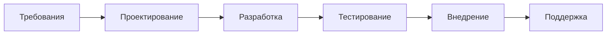
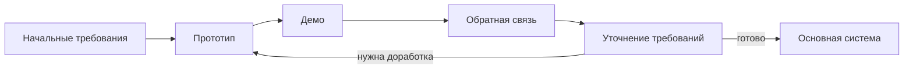

# Waterfall

> [!abstract] Суть
> Последовательные этапы: следующий начинается только после завершения предыдущего. Требования фиксируются **до** старта разработки.

---

# V-Model

> [!abstract] Суть
> Развитие водопада: каждому этапу проектирования соответствует свой уровень тестирования. Тесты планируются **параллельно** с требованиями, а не после кода.

| Проектирование (слева)     | ↔   | Тестирование (справа) |
| -------------------------- | --- | --------------------- |
| Требования пользователя    | ↔   | Приёмочное            |
| Системные требования       | ↔   | Системное             |
| Архитектура                | ↔   | Интеграционное        |
| Проектирование компонентов | ↔   | Модульное             |
| **Реализация (кодинг)**    |     | *нижняя точка V*      |

---

# Prototyping

> [!abstract] Суть
> Сначала делается упрощённая версия продукта, чтобы уточнить требования вместе с пользователями.

**Виды прототипов:**

| Тип            | Что это                                               |
| -------------- | ----------------------------------------------------- |
| Одноразовый    | Проверка идеи → выбрасывается, система пишется заново |
| Эволюционный   | Дорабатывается до полноценного продукта               |
| Горизонтальный | Много интерфейса, почти нет логики                    |
| Вертикальный   | Один сценарий целиком: UI → БД                        |

**Цикл:**

---
